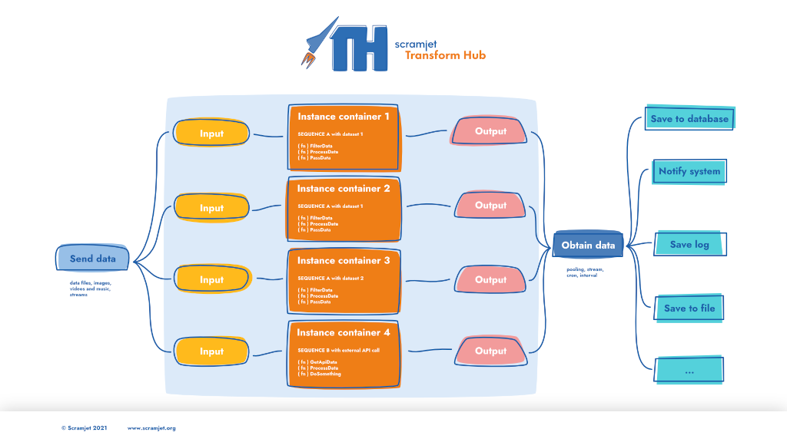

# **Scramjet Transform Hub - Quick Start**

<p align="center">
    <a href=https://github.com/scramjetorg/scramjet-cloud-docs/blob/main/LICENSE>
        </a>
    <a href=https://github.com/scramjetorg/scramjet-cloud-docs/stargazers>
        </a>
    <a href="https://www.paypal.com/cgi-bin/webscr?cmd=_s-xclick&hosted_button_id=7F7V65C43EBMW">
        </a>
    <a href="https://scramjet.org/">
        </a>
    <a href="https://join.slack.com/t/scramjetorg/shared_invite/zt-bb16pluv-XlICrq5Khuhbq5beenP2Fg">
        </a>
    <a href="https://www.linkedin.com/company/scramjet/">
        </a>
</p>
<p align="center">⭐ Star us on GitHub — it motivates us a lot! 🚀 </p>
<p align="center">
    
</p>

> :bulb: **Note**: This repository contains introductory documentation and code samples for Scramjet Transform Hub.

* Developers looking for source code repository should visit the following link [https://github.com/scramjetorg/transform-hub](https://github.com/scramjetorg/transform-hub).
* You can also find our packages published in NPM:
  * STH [https://www.npmjs.com/package/@scramjet/sth](https://www.npmjs.com/package/@scramjet/sth)
  * CLI [https://www.npmjs.com/package/@scramjet/cli](https://www.npmjs.com/package/@scramjet/cli)

---

## **Table of Contents**

1. [Introduction](#1-introduction)
    * [What is Scramjet Transform Hub](#11-what-is-scramjet-transform-hub-STH-?)
    * [Solution concept diagram](#12-solution-concept-diagram)
2. [Installation](#2-Installation)
    * [Prepare environment](#21-prepare-environment)
    * [Install STH](#22-install-sth)
3. [Run your first sequence](#3-run-your-first-sequence)
    * [Review the package](#31-review-the-package)
    * [Run the sequence](#32-run-the-sequence)
4. [Where to go next](#4-where-to-go-next)
5. [User's dictionary](#5-users-dictionary-book)

## **1. Introduction**

### **1.1 What is Scramjet Transform Hub**

Scramjet Transform Hub (STH) can be treated both as data processing engine and execution platform for multiple sequences running on the same platform and performing various data processing tasks.

STH allows you to deploy and run multiple data processing apps called sequences.

<details>
<summary>
    <strong>Sequences</strong>
</summary>

**Sequences** are specific apps, not just any apps. They specialize in efficient data processing.

We named our apps "sequences" and that term describes well its nature, as they process data through a sequence of chained functions. Therefore, usually our sequences are concise, easy to write and powerful at the same time.
</details>
<br>

The core part of our STH engine is called the "host".

<details>
<summary>
    <strong>Host</strong>
</summary>

**Host** is responsible for maintaining and deploying sequences, keeping them running and managing its lifecycle.

Host exposes also its own REST API to provide and receive data and manage sequences and host itself.

What we also do on the host level is that we apply a set of algorithms to optimize and speed up data processing execution in sequences.

> We call our processing optimization algorithms **"IFCA"** meaning "Intelligent Function Composition Algorithms".

You can interact with host using our dedicated STH CLI that will help you with sequences deployment, running it and monitoring.
</details>
<br>
Our vanilla STH engine is based on Node.js and thus allows developers to benefit from rich ecosystem, numerous packages and solutions provided by this vibrant community.

### **1.2 Solution concept diagram**



<details>
<summary>
    <strong>Inputs</strong>
</summary>

1. STH can handle any input that can be handled by Node.js application.
2. You, as a developer, are free to process variety of inputs in your sequence applications, such as: Text, JSON, XML, SOAP, Audio, Video and more.
3. Inputs can be either:
    * Provided to STH via its REST API; or
    * Consumed from various local or remote sources by the app; such as: Stream, STDIN, File, API, URL
    * Generated by the app itself

</details>

<details>
<summary>
    <strong>Host</strong>
</summary>

This is a solution for the central processing and management unit with the following major components:

1. **Sequences** - these are the actual "STH" apps. It is a gzipped package (`*.tar.gz`) containing at least two files:
    * **package.json** - JSON manifest file describing the app and its configuration; such as main file to run
    * **main file** - file such as `index.js` or `index.ts` that contains a lightweight application business logic.
2. **Instance** - once a sequence is run, the host will create a separate runtime environment for it and will execute sequence code inside this runtime entity. This is an instance.
3. **API & CLI** - our Application Programming Interface and CLI connecting to it allows both for **Data operations** (sending input data and receiving output data) and **Management operations** (manage host itself and its entities: sequences or instances)

</details>

<details>
<summary>
    <strong>Outputs</strong>
</summary>

Our engine outputs can be managed in several ways:

* **File** - you can save your output to a local or a remote file
* **STDOUT** - output can be directed to system STDOUT (STDERR is supported as well)
* **API** - output can be consumed from our  STH REST API
* **URL Request** - you can write your app in a way to request URL, webhook etc
* **Stream** - output can be streamed to a particular destination
* you can mix multiple actions together: you can both send data to remote system/URL and save it locally.

</details>

## **2. Installation**

### **2.1 Prepare environment**

In order to install Scramjet Transform Hub, please follow these 3 steps:

1. Get Linux machine (local UNIX/Linux OS, cloud VM etc)
2. Install Docker on this Linux machine ([official Docker instructions are here](https://docs.docker.com/get-docker/))
3. Install npm on this machine ([official instructions are here](https://nodejs.org/)). Currently we recommend Node.js version 16.x LTS.

### **2.2 Install STH**

Open one Linux terminal window and issue following commands:

* **Install Scramjet Transform Hub and  STH CLI:**

```bash
npm i -g @scramjet/sth @scramjet/cli
```

* **Run STH:**

```bash
scramjet-transform-hub
```

> :point_up: **HINT:** There is also an alias for running STH: `sth`

More detailed installation instructions can be found in our [STH GitHub repository](https://github.com/scramjetorg/transform-hub/tree/main#installation-clamp).

## **3. Run your first sequence**

### **3.1 Review the package**

Before running our first sequence let's have a quick look what's inside the sequence package.

We have prepared for you a simple JavaScript sample sequence "hello-snowman". This sequence is available in the directory `samples/hello-snowman` in this repository. In this directory you will find two files:

* `package.json` - manifest file that describes this particular sequence
* `index.js` - file containing main application logic.

This particular application is written in plain JavaScript to simplify this example. However, you can also write your sequences in TypeScript and build them before packaging and sending sequence to STH.

> In the [template's readme](templates/README.md) you will find a more specific descriptions of the particular file's content.

There is no need to change anything in our `hello-snowman` sequence for a first run. Let's move to the next step.

### **3.2 Run the sequence**

There are 4 steps to follow in order to run the example sequence:

<details>
<summary>
    <strong>1. Pack your sequence into a package</strong>
</summary>

Every "sequence" app needs to be packaged (compressed) before sending to the Transform Hub. Package is a simple TAR archive and our STH CLI has a special command to pack an app directory into a sequence tarball.

> :bulb: **Note:** any time, you can display STH CLI help by issuing terminal command `si help` (for general help) or `si <command> help` for specific command (ie. `si sequence help`)

Please open new terminal window (and keep the first one open with STH running). Then issue following commands in the root directory of this repository:

Pack directory `hello-snowman` into archive `hello-sequence.tar.gz`:

```bash
si pack ./samples/hello-snowman/ -o ./samples/hello-snowman.tar.gz
```

There is no output shown in the terminal but you can verify with `ls` that tarball package is created inside `samples` directory. Please move to the next step.

</details>

<details>
<summary>
    <strong>2. Send the sequence package</strong>
</summary>

Send `hello-snowman.tar.gz` to the running host (default localhost API endpoint will be used by the CLI send command) by issuing following command:

```bash
si sequence send ./samples/hello-snowman.tar.gz
```

> :bulb: **Note:** if you receive reply: **Request ok: <http://127.0.0.1:8000/api/v1/sequence> status: 422 Unprocessable Entity**, it means that STH Docker images are not yet pulled from DockerHub. Please wait 2-3 minutes and try to issue `si sequence send` command again. We are working on fixing this issue in the next STH release. Also, if you keep receiving docker errors you can start sth without docker: `scramjet-transform-hub --no-docker`

> If you encounter any problems or issues while using our platform, please visit our **[Troubleshooting](https://github.com/scramjetorg/transform-hub#troubleshooting-collision)** section, where some of the problems are already known and described. You can also log an issue/bug there.

The output will look similar to this one:

```bash
Request ok: http://127.0.0.1:8000/api/v1/sequence status: 202 Accepted
SequenceClient {
  _id: 'cf775cc1-105b-473d-b929-6885a0c2182c',
  host: HostClient {
    apiBase: 'http://127.0.0.1:8000/api/v1',
    client: ClientUtils {
      apiBase: 'http://127.0.0.1:8000/api/v1',
      log: [Object]
    }
  },
  sequenceURL: 'sequence/cf775cc1-105b-473d-b929-6885a0c2182c'
}
```

Now we have uploaded sequence to the host and host assigned to it a random ID (GUID), in this case our sequence ID is:

`_id: 'cf775cc1-105b-473d-b929-6885a0c2182c'`

 Host also exposes REST API endpoint for each sequence and this is also described in this response.

 Exposed sequence ID allows us to move to the next step where we will start the sequence.

</details>

<details>
<summary>
    <strong>3. Run the sequence</strong>
</summary>

We can now use sequence ID to start uploaded sequence. The command is `si seq start <sequence_id>`. You can also pass arbitrary number of parameters by providing them after `<sequence_id>`, in case of our `hello-snowman` no parameters are used.
Use the following command to start the sequence:

```bash
si sequence start cf775cc1-105b-473d-b929-6885a0c2182c
```

The output will look similar to this one:

```bash
Request ok: http://127.0.0.1:8000/api/v1/sequence/cf775cc1-105b-473d-b929-6885a0c2182c/start status: 200 OK
InstanceClient {
  host: HostClient {
    apiBase: 'http://127.0.0.1:8000/api/v1',
    client: ClientUtils {
      apiBase: 'http://127.0.0.1:8000/api/v1',
      log: [Object]
    }
  },
  _id: 'e70222d1-acfc-4e00-b046-4a3a9481c53b',
  instanceURL: 'instance/e70222d1-acfc-4e00-b046-4a3a9481c53b'
}
```

Sequence is an app template. Once it is up and running, it will become a new instance. Instance also receives its own ID (GUID). In this case instance ID is:

`_id: 'e70222d1-acfc-4e00-b046-4a3a9481c53b'`

Of course, sequences can be run multiple times. Each run will create a separate instance with a distinct instance ID.

</details>

<details>
<summary>
    <strong>4. Send data to the sequence</strong>
</summary>

We want to make your life easier and for this very example, we have prepared a special Node.js app that will generate a stream of simple messages and send them to our running instance of `hello-snowman`.

For fun, our stream generator will send simple text messages containing temperature readings from artificial weather station. Temperature value will be generated randomly in range of <-50,50> degrees Celsius.
Our `hello-snowman` app will read and interpret these messages and will inform us about state of our Snowman:

* if temperature will be 0 or below, sequence will return message: `Snowman ⛄ is freezing 🥶 Winter is coming ❄️ ❄️ ❄️ ❄️ ❄️`
* in the other case (temperature above 0 degrees), sequence will return message: `Snowman ⛄ is melting! 🥵`

To run this app, please execute the following command from the root of our directory `node ./tools/stream-gen-tool/stream-gen.js <instance_id>`. In our case this would look like this:

```bash
node ./tools/stream-gen-tool/stream-gen.js e70222d1-acfc-4e00-b046-4a3a9481c53b
```

The output will look similar to this one:

```js
----------------------------------------
Message# 1 | Temperature measure
INPUT | -16
OUTPUT| Snowman ⛄ is freezing 🥶 Winter is coming ❄️ ❄️ ❄️ ❄️ ❄️

----------------------------------------
Message# 2 | Temperature measure
INPUT | 49
OUTPUT| Snowman ⛄ is melting! 🥵

----------------------------------------
Message# 3 | Temperature measure
INPUT | 16
OUTPUT| Snowman ⛄ is melting! 🥵

----------------------------------------
Message# 4 | Temperature measure
INPUT | -46
OUTPUT| Snowman ⛄ is freezing 🥶 Winter is coming ❄️ ❄️ ❄️ ❄️ ❄️

----------------------------------------
```

Our sequence generator app does two things here:

* Sends stream of messages; each one containing number with temperature value
* Reads output from Host API that is generated by our `hello-snowman` sequences

Separately, you can also open a new terminal window and see log of this particular instance with command `si instance log <instance_id>`. In our case this would be:

```bash
si instance log e70222d1-acfc-4e00-b046-4a3a9481c53b
```

The sample output will be similar to this one:

```bash
...
2021-08-09T04:29:39.790Z log (object:Runner) Input message <Buffer 32 30>
2021-08-09T04:29:40.791Z log (object:Runner) Input message <Buffer 2d 34>
2021-08-09T04:29:41.792Z log (object:Runner) Input message <Buffer 33 33>
2021-08-09T04:29:42.798Z log (object:Runner) Input message <Buffer 2d 34 35>
2021-08-09T04:29:43.801Z log (object:Runner) Input message <Buffer 2d 33 36>
...
```

</details><br>

> Congratulations! :clap::clap::clap: You have run your first Scramjet Transform Hub sequence!

## **4. Where to go next**

Here you can find more resources related to Scramjet Transform Hub:

* [Check out more samples](samples) :books: - we have prepared some ready-to-use apps, which you can either use as a starting point for creating your own sequences or simply run them just to see what they do, and how the STH works with them.
* [Start from our app templates](templates) :file_folder: - almost  a blank file structure (package) and usage instructions, ready to be used as a starting point for building your own sequences. This is the simplest base we can provide for you to start with.
* [Contribute to STH development](https://github.com/scramjetorg/transform-hub) :construction_worker: - please feel free to contribute to STH development by submitting pull requests or creating issues.
* [Visit our Scramjet.org page](https://scramjet.org) :globe_with_meridians: - check out our website for more information about our Scramjet team, history and products.

## **5. User's dictionary :book:**

There is a lot of terminology that we use in our project that may already be known to you. We have prepared a [dictionary](dictionary.md) of terms that you may find useful and which you will learn as you learn about Scramjet Platform. We try to keep the definitions short and simple.

---
<br>

### Thank you for reading, we hope you enjoyed it. If not, here is a random cheer up joke, that may make you smile :grin:

<p></p>
<p align="center">
    <a href="https://readme-jokes.vercel.app/api">
        
    </a>
</p>
