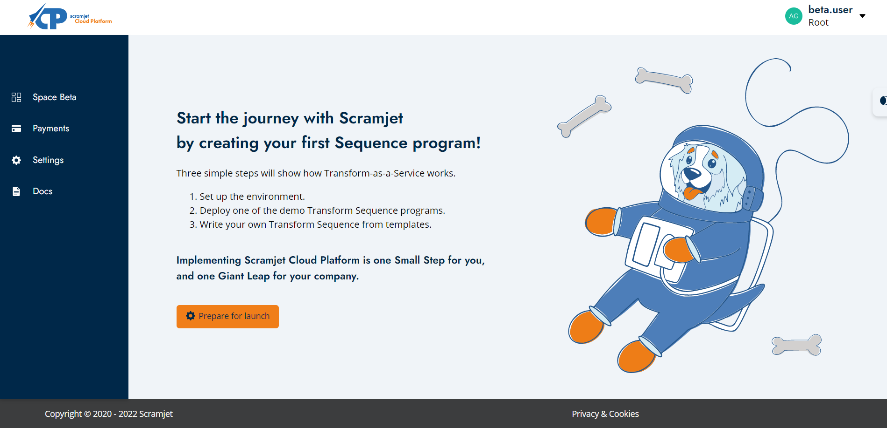

<h1 align="center"><strong>Scramjet Cloud Platform</strong></h1>
<p align="center">
    <a href="https://www.paypal.com/cgi-bin/webscr?cmd=_s-xclick&hosted_button_id=7F7V65C43EBMW">
        </a>
    <a href="https://scramjet.org/">
        </a>
     <a href="https://scr.je/ddoc"></a>
    <a href="https://www.linkedin.com/company/scramjet/">
        </a>
</p>
<p align="center">⭐ <a href="https://github.com/scramjetorg/scramjet-cloud-docs/stargazers">Star us on GitHub</a> — it motivates us a lot! 🚀 </p>
<p align="center">
    
</p>

* Developers looking for source code repository should visit the following link [https://github.com/scramjetorg/transform-hub](https://github.com/scramjetorg/transform-hub).
* You can also find our packages published in NPM:
  * STH [https://www.npmjs.com/package/@scramjet/sth](https://www.npmjs.com/package/@scramjet/sth)
  * CLI [https://www.npmjs.com/package/@scramjet/cli](https://www.npmjs.com/package/@scramjet/cli)

---

## **Table of Contents**

1. [Scramjet Cloud Platform](#1-scramjet-cloud-platform)
    * [Introduction](#11-introduction)
    * [Platform Quick Start](#12-platform-quick-start)
2. [Self hosted install](#2-self-hosted-installation)
    * [Prepare environment](#21-prepare-environment)
    * [Install STH](#22-install-sth)
3. [Run your first Sequence](#3-run-your-first-sequence)
    * [Review the package](#31-review-the-package)
    * [Run the Sequence](#32-run-the-sequence)
4. [Where to go next](#4-where-to-go-next)
5. [User's dictionary](#5-users-dictionary)

## **1. Scramjet Cloud Platform**

### **1.1. Introduction**

Scramjet Cloud Platform is a Serverless End-to-End Distributed Data Transformation Platform working in the Transform-as-a-Service model that can by itself acquire, transform and process data in real-time pipelines spanning across environments in different physical locations and cloud infrastructure providers.

The platform is used for uploading and executing programs, connecting their outputs with inputs using Topics and finally accessing the outputs via a centrally available API. You don't need to set up servers, operating systems and such, just write your program, package it, send it to us and let us know when you want them to start. We'll take care of the rest.

Scramjet Cloud Platform allows you to:

* write and deploy simple long-running data processing programs called Sequences,
* invoke Sequences with a simple CLI or programmatically via API or a set of client programs,
* monitor and control running Sequences via one central, publicly available, secure API,
* send and receive data produces and required by running Sequences,
* share data between multiple Sequences by enclosing them in Spaces,
* connect self-hosted servers to existing Data Spaces with minimum configuration,
* create execution environments at multiple cloud providers with a click of a button.

### **1.2. Platform Quick Start**

> **Deploy** and **execute** long running data **programs** that, **​transform** **in real-time** and transport **data** ​between multiple clouds and **on-premise** machines, just as **simply** as starting a program on a laptop, ​with no tedious configurations, VPNs or DevOps work.​

#### Log in to Scramjet Cloud Platform Beta Panel

<div className="w-200"></div>

|  |  To use our platform **free of charge for a year**, please [sign up for the beta program](https://scr.je/join-beta-docs). <br/> If you are already our user, please log in to the [Scramjet Cloud Platform Beta Panel](https://console.beta.scramjet.cloud/) through your provided mail and set the new password by clicking `Forgot the password`. |
| ------------------------------------------------------- | ------------------------------------------------------------------------------------------------------------------------------------------------------------------------------ |

#### Start the journey with Scramjet 🚀

There are only three simple steps!

* [Set up the environment](https://console.beta.scramjet.cloud/settings).
* [Deploy one of the demo Transform Sequence programs](https://docs.scramjet.org/platform/samples).
* Write your own Transform Sequence from [templates](https://docs.scramjet.org/platform/templates) in [JavaScript](https://docs.scramjet.org/platform/development-guide-js), [TypeScript](https://docs.scramjet.org/platform/development-guide-ts) or [Python](https://docs.scramjet.org/platform/development-guide-py)

#### Step 1: Set up the environment

Dear user, in order to use our Beta Space, you need to have Linux based operating system installed eg. Ubuntu.
You will also need Node.js together with its package manager npm. Please refer to installation helper for node and npm in case of any problems. You must have Bash installed while using Windows.

Open the command prompt and follow the steps below to configure Scramjet Cloud Platform (SCP).

1. Check if the SCP Command Line Interface (SCP CLI) is installed by typing `si` into the terminal. If not, install SCP CLI by the command.

   ```bash
   npm i -g @scramjet/cli && si --help
   ```

2. Generate SCP CLI Token.

   [](https://console.beta.scramjet.cloud/settings)

   After token generation copy and paste the following CLI command for setting up config.

   ```bash
   si config set json '{"middlewareApiUrl": "https://api.beta.scramjet.cloud/api/v1", "env": "production", "token": "<GeneratedToken>"}'
   ```

3. Check if your setup is working properly by listing your programs (Sequences).

   ```bash
   si seq list
   ```

4. There should be sample program listed. Start it using the command:

   ```bash
   si seq start <sequence-id>
   ```

5. After the program starts the Instance id will be returned.

   Show output data from the running program (instance).

   ```bash
   si inst output <instance-id>
   ```

6. Open the new terminal and type the commend below and hit enter.

   ```bash
   si inst input <instance-id>
   ```

After the command execution, running Instance awaits for data to be passed as stdin. To do that please type into the command prompt, for example "John" and hit enter. In the terminal window where we read the Instance output the message: "Hello John" should appear.

## **2. Self Hosted Installation**

### **2.1 Prepare environment**

In order to install Scramjet Transform Hub, please follow these 3 steps:

1. Get Linux machine (local UNIX/Linux OS, cloud VM etc)
2. Install Docker on this Linux machine ([official Docker instructions are here](https://docs.docker.com/get-docker/))
3. Install npm on this machine ([official instructions are here](https://nodejs.org/)). Currently we recommend Node.js version 16.x LTS.

### **2.2 Install STH**

Open one Linux terminal window and issue following commands:

* **Install Scramjet Transform Hub and  STH CLI:**

```bash
npm i -g @scramjet/sth @scramjet/cli
```

* **Run STH:**

```bash
scramjet-transform-hub
```

> 💡 **HINT:** There is also an alias for running STH:
>
>```bash
>sth
>```

More detailed installation instructions can be found in our [STH GitHub repository](https://github.com/scramjetorg/transform-hub//HEAD/#installation-clamp).

## **3. Run your first Sequence**

### **3.1 Review the package**

Before running your first Sequence let's have a quick look what's inside the Sequence package.

We have prepared for you a simple JavaScript sample Sequence "hello-snowman". This Sequence is available in the directory `javascript/hello-snowman` in the [Scramjet Cloud Platform Samples repository](https://github.com/scramjetorg/platform-samples).

In this directory you will find two files:

* `package.json` - manifest file that describes this particular Sequence
* `index.js` - file containing main application logic.

This particular application is written in plain JavaScript to simplify this example. However, you can also write your Sequences in TypeScript and build them before packaging and sending Sequence to STH.

> In the [template's readme](templates/README.md) you will find a more specific descriptions of the particular file's content.

There is no need to change anything in our `hello-snowman` Sequence for a first run. Let's move to the next step.

### **3.2 Run the Sequence**

There are 4 steps to follow in order to run the example Sequence:

<details>
<summary>
    <strong>1. Pack your Sequence into a package</strong>
</summary>

Every "Sequence" app needs to be packaged (compressed) before sending to the Transform Hub. Package is a simple TAR archive and our STH CLI has a special command to pack an app directory into a Sequence tarball.

> 💡 **Note:** any time, you can display STH CLI help by issuing terminal command `si help` (for general help) or `si <command> help` for specific command (ie. `si sequence help`)

Please open new terminal window (and keep the first one open with STH running). Then issue following commands in the root directory of this repository:

Pack directory `hello-snowman` into archive `hello-sequence.tar.gz`:

```bash
si pack /javascript/hello-snowman/ -o ./dist/hello-snowman.tar.gz
```

There is no output shown in the terminal but you can verify with `ls` that tarball package is created inside `dist` directory. Please move to the next step.

</details>

<details>
<summary>
    <strong>2. Send the Sequence package</strong>
</summary>

Send `hello-snowman.tar.gz` to the running host (default localhost API endpoint will be used by the CLI send command) by issuing following command:

```bash
si sequence send ./javascript/hello-snowman.tar.gz
```

> 💡 **Note:** if you receive reply: **Request ok: <http://127.0.0.1:8000/api/v1/sequence> status: 422 Unprocessable Entity**, it means that STH Docker images are not yet pulled from DockerHub. Please wait 2-3 minutes and try to issue `si sequence send` command again. We are working on fixing this issue in the next STH release. Also, if you keep receiving docker errors you can start STH without docker: `scramjet-transform-hub --no-docker`

> If you encounter any problems or issues while using our platform, please visit our **[Troubleshooting](https://github.com/scramjetorg/transform-hub#troubleshooting-collision)** section, where some of the problems are already known and described. You can also log an issue/bug there.

The output will look similar to this one:

```bash
Request ok: http://127.0.0.1:8000/api/v1/sequence status: 202 Accepted
SequenceClient {
  _id: 'cf775cc1-105b-473d-b929-6885a0c2182c',
  host: HostClient {
    apiBase: 'http://127.0.0.1:8000/api/v1',
    client: ClientUtils {
      apiBase: 'http://127.0.0.1:8000/api/v1',
      log: [Object]
    }
  },
  sequenceURL: 'sequence/cf775cc1-105b-473d-b929-6885a0c2182c'
}
```

Now we have uploaded Sequence to the host and host assigned to it a random ID (GUID), in this case our Sequence ID is:

`_id: 'cf775cc1-105b-473d-b929-6885a0c2182c'`

 Host also exposes REST API endpoint for each Sequence and this is also described in this response.

 Exposed Sequence ID allows us to move to the next step where we will start the Sequence.

</details>

<details>
<summary>
    <strong>3. Run the Sequence</strong>
</summary>

We can now use Sequence ID to start uploaded Sequence. The command is `si seq start <sequence_id>`. To make our users life easier we provided an alias for Sequence ID: `si seq start -`. This CLI functionality replaces `-` argument with the last item the user interacted with or `select`ed.

Also, an arbitrary number of parameters can be passed to a Sequence while `start`ing by providing them after `<sequence_id>` or `-` alias. In case of our `hello-snowman` no parameters are used.

Use the following command to start the Sequence:

```bash
si sequence start cf775cc1-105b-473d-b929-6885a0c2182c
```

or

```bash
si sequence start -
```

The output will look similar to this one:

```bash
Request ok: http://127.0.0.1:8000/api/v1/sequence/cf775cc1-105b-473d-b929-6885a0c2182c/start status: 200 OK
InstanceClient {
  host: HostClient {
    apiBase: 'http://127.0.0.1:8000/api/v1',
    client: ClientUtils {
      apiBase: 'http://127.0.0.1:8000/api/v1',
      log: [Object]
    }
  },
  _id: 'e70222d1-acfc-4e00-b046-4a3a9481c53b',
  instanceURL: 'instance/e70222d1-acfc-4e00-b046-4a3a9481c53b'
}
```

Sequence is an app template. Once it is up and running, it will become a new Instance. The Instance also receives its own ID (GUID). In this case the Instance ID is:

`_id: 'e70222d1-acfc-4e00-b046-4a3a9481c53b'`

Of course, Sequences can be run multiple times. Each run will create a separate Instance with a distinct Instance ID.

</details>

<details>
<summary>
    <strong>4. Send data to the Sequence</strong>
</summary>

We want to make your life easier and for this very example, we have prepared a special Node.js app that will generate a stream of simple messages and send them to our running Instance of `hello-snowman`.

For fun, our stream generator will send simple text messages containing temperature readings from artificial weather station. Temperature value will be generated randomly in range of <-50,50> degrees Celsius.
Our `hello-snowman` app will read and interpret these messages and will inform us about state of our Snowman:

* if temperature will be 0 or below, Sequence will return message: `Snowman ⛄ is freezing 🥶 Winter is coming ❄️ ❄️ ❄️ ❄️ ❄️`
* in the other case (temperature above 0 degrees), Sequence will return message: `Snowman ⛄ is melting! 🥵`

To run this app, please execute the following command from the root of our directory `node ./tools/stream-gen-tool/stream-gen.js <instance_id>`. In our case this would look like this:

```bash
node ./tools/stream-gen-tool/stream-gen.js e70222d1-acfc-4e00-b046-4a3a9481c53b
```

The output will look similar to this one:

```js
----------------------------------------
Message# 1 | Temperature measure
INPUT | -16
OUTPUT| Snowman ⛄ is freezing 🥶 Winter is coming ❄️ ❄️ ❄️ ❄️ ❄️

----------------------------------------
Message# 2 | Temperature measure
INPUT | 49
OUTPUT| Snowman ⛄ is melting! 🥵

----------------------------------------
Message# 3 | Temperature measure
INPUT | 16
OUTPUT| Snowman ⛄ is melting! 🥵

----------------------------------------
Message# 4 | Temperature measure
INPUT | -46
OUTPUT| Snowman ⛄ is freezing 🥶 Winter is coming ❄️ ❄️ ❄️ ❄️ ❄️

----------------------------------------
```

Our Sequence generator app does two things here:

* Sends stream of messages; each one containing number with temperature value
* Reads output from Host API that is generated by our `hello-snowman` Sequence

Separately, you can also open a new terminal window and see log of this particular Instance with command `si instance log <instance_id>` or by using alias `si instance log -`. In our case this would be:

```bash
si instance log e70222d1-acfc-4e00-b046-4a3a9481c53b
```

The sample output will be similar to this one:

```bash
Request ok: http://127.0.0.1:8000/api/v1/instance/e70222d1-acfc-4e00-b046-4a3a9481c53b/log status: 200 OK
{"level":"DEBUG","msg":"Streams initialized","ts":1647447631103,"from":"Runner","Runner":{"id":"e70222d1-acfc-4e00-b046-4a3a9481c53b"}}
{"level":"TRACE","msg":"Handshake sent","ts":1647447631103,"from":"Runner","Runner":{"id":"e70222d1-acfc-4e00-b046-4a3a9481c53b"}}
{"level":"DEBUG","msg":"Control message received","ts":1647447631113,"from":"Runner","Runner":{"id":"e70222d1-acfc-4e00-b046-4a3a9481c53b"},"data":[4000,{"appConfig":{},"args":[]}]}
{"level":"DEBUG","msg":"Handshake received","ts":1647447631113,"from":"Runner","Runner":{"id":"e70222d1-acfc-4e00-b046-4a3a9481c53b"}}
{"level":"DEBUG","msg":"Sequence","ts":1647447631115,"from":"Runner","Runner":{"id":"e70222d1-acfc-4e00-b046-4a3a9481c53b"},"data":[[null]]}
{"level":"INFO","msg":"Sequence loaded, functions count","ts":1647447631116,"from":"Runner","Runner":{"id":"e70222d1-acfc-4e00-b046-4a3a9481c53b"},"data":[1]}
{"level":"DEBUG","msg":"Processing function on index","ts":1647447631116,"from":"Runner","Runner":{"id":"e70222d1-acfc-4e00-b046-4a3a9481c53b"},"data":[0]}
{"level":"DEBUG","msg":"Function called","ts":1647447631116,"from":"Runner","Runner":{"id":"e70222d1-acfc-4e00-b046-4a3a9481c53b"},"data":[0]}
{"level":"INFO","msg":"All sequences processed.","ts":1647447631116,"from":"Runner","Runner":{"id":"e70222d1-acfc-4e00-b046-4a3a9481c53b"}}
{"level":"DEBUG","msg":"Stream type is","ts":1647447631116,"from":"Runner","Runner":{"id":"e70222d1-acfc-4e00-b046-4a3a9481c53b"},"data":["object"]}
{"level":"TRACE","msg":"Piping sequence output","ts":1647447631117,"from":"Runner","Runner":{"id":"e70222d1-acfc-4e00-b046-4a3a9481c53b"},"data":["object"]}
{"level":"DEBUG","msg":"Content-Type","ts":1647447645282,"from":"Runner","Runner":{"id":"e70222d1-acfc-4e00-b046-4a3a9481c53b"},"data":["application/octet-stream"]}
...
```

</details>

<details>
<summary>
    <strong>5. Get the Instance output</strong>
</summary>

Once `hello-snowman` Sequence is up and running, we have also sent some input data to the Instance to consume. To see what the program does to this data use the command below, it will show you the Instance output after data transformation. Open one more terminal and paste:

```bash
si inst output e70222d1-acfc-4e00-b046-4a3a9481c53b
```

or by using alias

```bash
si inst output -
```

This is an example output that you should get:

```bash
Snowman ⛄ is freezing 🥶 Winter is coming ❄️ ❄️ ❄️ ❄️ ❄️
Snowman ⛄ is freezing 🥶 Winter is coming ❄️ ❄️ ❄️ ❄️ ❄️
Snowman ⛄ is freezing 🥶 Winter is coming ❄️ ❄️ ❄️ ❄️ ❄️
Snowman ⛄ is melting! 🥵
Snowman ⛄ is melting! 🥵
Snowman ⛄ is melting! 🥵
Snowman ⛄ is freezing 🥶 Winter is coming ❄️ ❄️ ❄️ ❄️ ❄️
Snowman ⛄ is freezing 🥶 Winter is coming ❄️ ❄️ ❄️ ❄️ ❄️
Snowman ⛄ is melting! 🥵
Snowman ⛄ is freezing 🥶 Winter is coming ❄️ ❄️ ❄️ ❄️ ❄️
Snowman ⛄ is freezing 🥶 Winter is coming ❄️ ❄️ ❄️ ❄️ ❄️
Snowman ⛄ is freezing 🥶 Winter is coming ❄️ ❄️ ❄️ ❄️ ❄️
Snowman ⛄ is melting! 🥵
Snowman ⛄ is freezing 🥶 Winter is coming ❄️ ❄️ ❄️ ❄️ ❄️
Snowman ⛄ is freezing 🥶 Winter is coming ❄️ ❄️ ❄️ ❄️ ❄️
Snowman ⛄ is melting! 🥵
Snowman ⛄ is freezing 🥶 Winter is coming ❄️ ❄️ ❄️ ❄️ ❄️
```

</details><br>

🎉 Congratulations! 🥳 You have run your first Scramjet Transform Hub Sequence!

> To see more Sequence or Instance CLI commands use `si help` accordingly:
>
>* `si seq help`
>
>* `si inst help`

## **4. Where to go next**

Here you can find more resources related to Scramjet Transform Hub:

* 📚 [Check out more sequence samples](https://github.com/scramjetorg/platform-samples) - we have prepared some ready-to-use apps, which you can either use as a starting point for creating your own Sequences or simply run them just to see what they do, and how the STH works with them.
* 📂 [Start from our app templates](templates) - almost  a blank file structure (package) and usage instructions, ready to be used as a starting point for building your own Sequences. This is the simplest base we can provide for you to start with.
* 🧑‍💻 [Contribute to STH development](https://github.com/scramjetorg/transform-hub)  - please feel free to contribute to STH development by submitting pull requests or creating issues.
* 🌐 [Visit our Scramjet.org page](https://scramjet.org)  - check out our website for more information about our Scramjet team, history and products.
* 🏖️ [Donate to our team's fun fund](https://www.paypal.com/cgi-bin/webscr?cmd=_s-xclick&hosted_button_id=7F7V65C43EBMW)

## **5. User's dictionary**

There is a lot of terminology that we use in our project that may already be known to you. We have prepared a [dictionary](dictionary.md) of terms that you may find useful and which you will learn as you learn about Scramjet Platform. We try to keep the definitions short and simple.

---
<br>

### Thank you for reading, we hope you enjoyed it. If not, here is a random cheer up joke, that may make you smile 😁 <!-- omit in toc -->

<br>
<p></p>
<p align="center">
    <a href="https://readme-jokes.vercel.app/api">
        
    </a>
</p>
