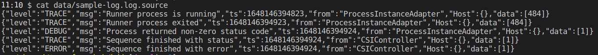
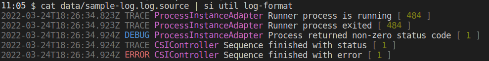
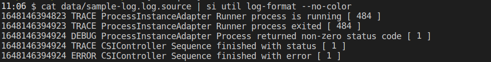

# Command Line Interface Reference

We introduce you to Scramjet Command Line Interface (SI). This document focuses on the practical side of using our CLI. Getting familiar with CLI commands which can make your work more productive and also give you a possibility to bring more automation into your scripts.

- [Installation](#installation)
  - [Autocompletion](#autocompletion)
- [Configuration](#configuration)
  - [Global configuration](#global-configuration)
  - [Profile configuration](#profile-configuration)
  - [Session configuration](#session-configuration)
  - [Config commands](#config-commands)
- [Basic usage](#basic-usage)
  - [Scope commands](#scope-commands)
  - [Space commands](#space-commands)
  - [Hub commands](#hub-commands)
  - [Sequence commands](#sequence-commands)
  - [Instance commands](#instance-commands)
  - [Topic commands](#topic-commands)
- [Advanced usage](#advanced-usage)
  - [Util commands](#util-commands)
- [Self-Hosted Hub: Scramjet Transform Hub](#self-hosted-hub-scramjet-transform-hub)

---

## Installation

Install the Scramjet CLI using npm:

```bash
npm install -g @scramjet/cli
```

Once installed, the Scramjet CLI is available under the `si` command that stands for **Scramjet Interface**.

To confirm the installation is complete you can list the available commands by running either `si` with no parameters or `si --help`:

```bash
$ si
Current profile: default
Usage: si [options] [command]

This is a Scramjet Command Line Interface to communicate with Transform Hub and Cloud Platform.

Options:
  -v, --version            Display current CLI version
  --config <name>          Set global configuration profile
  --config-path <path>     Set global configuration from file
  -h, --help               display help for command

Commands:
  hub                      Allows to run programs in different data centers, computers or devices in local network
  config|c                 Config contains default Scramjet Transform Hub (STH) and Scramjet Cloud Platform (SCP) settings
  scope|s                  Manage scopes that store pairs of spaces and Hubs used when working
  space|spc [options]      Operations on grouped and separated runtime environments that allow sharing the data within them
  sequence|seq             Operations on a Sequence package, consisting of one or more functions executed one after another
  instance|inst [command]  Operations on the running Sequence
  topic                    Manage data flow through topics operations
  completion               completion operations
  util|u                   Various utilities
```

Show subcommand help by providing `--help` or `-h` option after each as in the example below.

```bash
Usage
    si [command] --help

Example
    si sequence -h
```

### Autocompletion

You are probably familiar with the autocomplete behavior in bash. We would like to introduce a similar system that provides a convenient tab completion of SI commands.
To use `si` with command hints, install the completion script. This script depends on bash-completion, so please make sure that it is installed by running:

```bash
type _init_completion
```

Running command `si completion bash` prints out the script to the terminal.

The command below installs the completion script in `~/.bashrc`.

```bash
si completion install
```

After the installation, you should be able to see command hints by hitting `Tab` twice. You can also use `Tab` to autocomplete the names of the commands, but for this to work, the command name must be started with at least one or two letters.

---

## Configuration

The CLI interface can work in either the development or production environment. An environmental value that is set to production allows to use commands of the Scramjet Cloud Platform. The CLI development environment communicates with the Transform Hub.

There are 3 configuration types inside CLI for different purpose:

1. Default configuration - contains default values for the Scramjet Transform Hub (STH) settings.
2. Profile configuration - contains personalized values for the Scramjet Transform Hub (STH) and Scramjet Cloud Platform settings.
3. Session configuration - contains values for the current session.

### Default configuration

**Default SI configuration** is a global configuration file used by all CLI processes. This is a basic configuration used by CLI when no other is chosen or set.

This is an example of a 'default.json' file:

```json
{
  "configVersion": 1,
  "apiUrl": "http://127.0.0.1:8000/api/v1",
  "middlewareApiUrl": "",
  "env": "development",
  "scope": "",
  "token": "",
  "log": {
    "debug": false,
    "format": "pretty"
  }
}
```

Properties description:

| Property           | Description            | Default value |
| ------------------ | -----------------------|---------------|
| `configVersion`    | A version of the config.| `1` |
| `apiUrl`           | Hub API url. Applicable only to self hosted Hub.| `"http://127.0.0.1:8000/api/v1"` |
| `middlewareApiUrl` | Scramjet Cloud Platform Space url. To be set during authorization process.| `""`   |
| `env`              | Set the environment you will work in: <br /> - `"production"` → for Scramjet Cloud Platform environment, <br /> - `"development"` → to communicate with Transform Hub (self hosted Hub environment). | `"development"` |
| `scope`            | A default scope that should be used when session starts.| `""` |
| `token`            | Scramjet Cloud Platform authorization token. To be set during authorization process.| `""` |
| `log`              | `"log"` property contains two additional properties: <br /> - `"debug"` → if error occurs stack trace can be shown/hide with the `"true"`/`"false"` option, <br /> - `"format"` → log messages display can be set to `"pretty"` or `"json"`. <br/> | `"debug"`: `false` <br/> `"format"`: `"pretty"` |

Every value can be set for every config property by using command `si config set [command]`

### Profile configuration

**Profile configuration** refers to all configurations that can be manipulated and set by user. Profile configuration can be provided in two ways:

  1. Path to outside configuration file provided by user (read only file, requires all configuration fields in file):
      - `si <someCliCommand> --config-path some/path/toFile`
      - `process.env: SI_CONFIG_PATH=some/path/toFile si <someCliCommand>`

      Below the example of a `profile-config.json` file saved on the disk:

      ```json
      {
      "configVersion": 1,
      "apiUrl": "http://127.0.0.1:8000/api/v1",
      "middlewareApiUrl": "https://api.beta.scramjet.cloud/api/v1",
      "env": "production",
      "scope": "",
      "token": "generatedToken",
      "log": 
        {
          "debug": false,
          "format": "pretty"
        }
      }
      ```

      and its use from the command line:

      ```bash
      # check profile
      $ si c profile ls
      Available profiles:
        default
      -> production

      # check current profile settings
      $ si c p
      Current profile: production

      {
        configVersion: 1,
        apiUrl: 'http://127.0.0.1:8000/api/v1',
        middlewareApiUrl: '',
        env: 'development',
        scope: '',
        token: '',
        log: { debug: false, format: 'pretty' }
      }

      # si command execution with external profile configuration
      $ si hub info --config-path /home/user/profile-config.json
      {
        id: 'sth-0',
        info: {
          created: '2022-08-10T09:22:42.011Z',
          lastConnected: '2022-08-10T09:22:42.014Z'
        },
        healthy: true,
        isConnectionActive: true
      }
      ```

      ```bash
      $ SI_CONFIG_PATH=/home/user/profile-config.json si hub info
      {
        id: 'sth-0',
        info: {
          created: '2022-08-10T09:22:42.011Z',
          lastConnected: '2022-08-10T09:22:42.014Z'
        },
        healthy: true,
        isConnectionActive: true
      }
      ```

      The examples above show that CLI uses the external profile configuration provided by user over the configuration set in CLI profile.
      <br />
      <br />

  2. Profile name to configuration handled and manipulated by CLI resources files:
      - `si <someCliCommand> --config <profileName>`

      ```bash
      $ si c profile ls
      Available profiles:
         default
      -> production
         testing

      $ si hub version --config testing
      {
        service: '@scramjet/host',
        apiVersion: 'v1',
        version: '0.27.0',
        build: 'becd14d'
      }
      ```

      - `process.env: SI_CONFIG=profileName si <someCliCommand>`

      ```bash
      $ si c profile ls
      Available profiles:
         default
      -> production
         testing

      $ SI_CONFIG=testing si hub version
      {
        service: '@scramjet/host',
        apiVersion: 'v1',
        version: '0.27.0',
        build: 'becd14d'
      }
      ```

      - `si config profile use <profileName>` - sets a `<profileName>` as a default profile for all shells

      ```bash
      $ si config profile use testing

      $ si config profile ls
      Available profiles:
         default
         production
      -> testing
      ```

   There is always at least a default profile file ('default.json') if none of the above method is used to set config profile.
   Order of precedence for profile configuration is added (if profile config is set with many options only highest precedence is used).

   When user sets any value in `si config`, by calling `si config set [command]`, for example: `si config set log --format pretty` the changes will appear in the currently used profile. If config is provided from user file, exception will be thrown:

   ```bash
    $ si c set env development  --config-path /home/user/my-profile-config.json
    Error: Unable to write for read only configuration
   ```

   It means that `si config set [command]` will change the profile config properties only, not the properties in the config file provided by user.

   <br />

   #### Creating profiles

   <br />Profiles can be managed by a CLI command `si config profile [command]`

   <br />

   Creating profiles is optional. As mentioned before, there is always a default config available. CLI works with it when no profile is created, but it can be quite useful to have some profiles when working with multiple environments, scopes or spaces at the same time.
   This is the list of available `si config profile` commands.

   ```bash
   list|ls                       # Show available configuration profiles
   use <name>                    # Set configuration profile as default to use
   create <name>                 # Create new configuration profile
   remove <name>                 # Remove existing profile configuration
   ```

   **To create a profile:**

   1. Create a new profile using command `si config profile create <profileName>`. When creating a new profile, next to the default configuration file named 'default.json', a new configuration file named 'newProfile.json' is created with all the property values set to default. After creation, the new profile is NOT automatically set as default. You have to switch to the target profile if you want to set new values for it.
   2. List all profiles using command `si config profile list` to see your new profile on the list. The arrow points at the profile which is currently in use. Also a 'si-config.json' file indicates which profile is currently in use.
   3. Switch to the new profile using command `si config profile use profileName`
   This is how the above steps execution would look in the terminal:

   ```bash
   # list profiles
   $ si config profile ls
      Available profiles:
      -> default

   # create profile named 'production'
   $ si config profile create production

   # create profile named 'development'
   $ si config profile create development

   # list profiles
   $ si config profile ls
    Available profiles:
    -> default
      development
      production

   # switch to 'development' profile
   $ si config profile use development

   # list profiles to confirm profile change
   $ si config profile ls
    Available profiles:
      default
    -> development
      production
   ```

   4. Set new values. You can set new values in your profile by using command `si config set [command]`.
   5. Display your config content with `si config print` (too lazy to type? Roger that! Use `si c p` instead).

   ```bash
   # print out current profile config
   $ si c p
    Current profile: development

    {
      configVersion: 1,
      apiUrl: 'http://127.0.0.1:8000/api/v1',
      middlewareApiUrl: '',
      env: 'development',
      scope: '',
      token: '',
      log: { debug: false, format: 'pretty' }
    }
    # change apiUrl property value
    $ si config set apiUrl "http://127.0.0.1:9000/api/v1"

    # set debug property to true
    $ si config set log --debug true

    # set log format to json
    $ si config set log --format json

    # print out the config again to see the changes
    $ si c p
    Current profile: development
    {"configVersion":1,"apiUrl":"http://127.0.0.1:9000/api/v1","middlewareApiUrl":"","env":"development","scope":"","token":"","log":{"debug":true,"format":"json"}}
   ```

   6. Delete profile with `si config profile remove <profileName>`. If you are deleting the profile you are currently using, you will be switched to the `default` profile right after the deletion.

   ```bash
   # list profiles
   $ si config profile ls
    Available profiles:
      default
    -> development
      production

    # remove profile 'development'
    $ si config profile remove development

    # list profiles again to check if the profile was removed
    $ si config profile ls
    Available profiles:
    -> default
      production
   ```

   7. It is possible to reset all config values at once by using command `si config reset all`.

   ```bash
   # print out current profile config
   $ si c p
    Current profile: development

    {
      configVersion: 1,
      apiUrl: 'http://127.0.0.1:9000/api/v1',
      middlewareApiUrl: '',
      env: 'production',
      scope: '',
      token: '',
      log: { debug: true, format: 'pretty' }
    }

    # reset all the config values
    $ si config reset all

    # print out the config again to see the changes
    $ si c p
    Current profile: development

    {
      configVersion: 1,
      apiUrl: 'http://127.0.0.1:8000/api/v1',
      middlewareApiUrl: '',
      env: 'development',
      scope: '',
      token: '',
      log: { debug: false, format: 'pretty' }
    }
   ```

### Session configuration

**Session configuration** is a configuration used inside of CLI to handle all `lastXxx` parameters. Configuration is kept alive in terminal (shell session time of life) that uses CLI (as outcome every terminal will have it's own lastXXX params). With this solution, you can move freely between terminal sessions and communicate with your Hubs and Sequences even more effectively. <br> A session configuration file named `session-config.json` is created locally in the temporary directory named after session id, for example: `/tmp/.si-tmp/4020249`. After the session terminates, the directory is removed along with its contents. The configuration `session-config.json` file is created at the moment of initiating the command related to packing and running the Sequence. This action results in the first write to the session configuration file as a value assignment to the parameters `"lastPackagePath"`, `"lastInstanceId"` and `"lastSequenceId"`.
<br />
<br />

To print out the current session configuration, use `si config session` command.

```bash
{
  lastPackagePath: '',
  lastInstanceId: '',
  lastSequenceId: '',
  lastSpaceId: '',
  lastHubId: '',
  sessionId: '4099770'
}
```

`"lastInstanceId"` and `"lastSequenceId"` values are set automatically while running `si seq deploy` or `si seq send` and `si seq start` commands. They can be also set manually with commands:

- `si seq use <sequenceID>`

- `si inst use <instanceID>`

This becomes useful when you want to change the Sequence or Instance ID assigned to alias (`-`).

Lets set an example to show how it works.

```bash
# print out current session config
$ si config session

{
  lastPackagePath: '',
  lastInstanceId: '',
  lastSequenceId: '',
  lastSpaceId: '',
  lastHubId: '',
  sessionId: '4125483'
}

# deploy a sequence
$ si seq deploy /hello.tar.gz
SequenceClient {
  _id: '0f424150-5f01-420a-85d0-54ebf4701fc3',
  host: HostClient {
    apiBase: 'http://127.0.0.1:8000/api/v1',
    client: ClientUtils {
      apiBase: 'http://127.0.0.1:8000/api/v1',
      fetch: [Function (anonymous)],
      normalizeUrlFn: [Function: normalizeUrl]
    }
  },
  sequenceURL: 'sequence/0f424150-5f01-420a-85d0-54ebf4701fc3'
}
InstanceClient {
  host: HostClient {
    apiBase: 'http://127.0.0.1:8000/api/v1',
    client: ClientUtils {
      apiBase: 'http://127.0.0.1:8000/api/v1',
      fetch: [Function (anonymous)],
      normalizeUrlFn: [Function: normalizeUrl]
    }
  },
  _id: '907ed318-7260-47ce-9b83-6bd95da60429',
  instanceURL: 'instance/907ed318-7260-47ce-9b83-6bd95da60429'
}

# print out the session config again to check if the values have been assigned
$ si config session

{
  lastPackagePath: '',
  lastInstanceId: '907ed318-7260-47ce-9b83-6bd95da60429',
  lastSequenceId: '0f424150-5f01-420a-85d0-54ebf4701fc3',
  lastSpaceId: '',
  lastHubId: '',
  sessionId: '4125483'
}

# start the sequence again using alias `-`
$ si seq start -
InstanceClient {
  host: HostClient {
    apiBase: 'http://127.0.0.1:8000/api/v1',
    client: ClientUtils {
      apiBase: 'http://127.0.0.1:8000/api/v1',
      fetch: [Function (anonymous)],
      normalizeUrlFn: [Function: normalizeUrl]
    }
  },
  _id: '75fdb61a-e473-4af6-a0b1-59e2b6c1486b',
  instanceURL: 'instance/75fdb61a-e473-4af6-a0b1-59e2b6c1486b'
}

# check session config, after starting the sequence again, lastInstanceId is set to the new value
$ si config session

{
  lastPackagePath: '',
  lastInstanceId: '75fdb61a-e473-4af6-a0b1-59e2b6c1486b',
  lastSequenceId: '0f424150-5f01-420a-85d0-54ebf4701fc3',
  lastSpaceId: '',
  lastHubId: '',
  sessionId: '4125483'
}

# change lastInstanceId to another instance id
$ si inst use 907ed318-7260-47ce-9b83-6bd95da60429

# print out the session config again to check if the lastInstanceId has been changed
$ si config session

{
  lastPackagePath: '',
  lastInstanceId: '907ed318-7260-47ce-9b83-6bd95da60429',
  lastSequenceId: '0f424150-5f01-420a-85d0-54ebf4701fc3',
  lastSpaceId: '',
  lastHubId: '',
  sessionId: '4125483'
}
```

Configuration file `session-config.json` creation can be also initialized while [setting up the environment for Scramjet Cloud Platform](../platform/quick-start), for example:

```bash
$ si config session
{
  lastPackagePath: '',
  lastInstanceId: '',
  lastSequenceId: '',
  lastSpaceId: '',
  lastHubId: '',
  sessionId: '340908'
}

$ si config set json '{"middlewareApiUrl": "https://api.beta.scramjet.cloud/api/v1", "env": "production", "token": "generatedToken"}'

$ si config session

Defaults set to: Space: org-a10d5cb5-4ca53c2e2a05-manager, Hub: sth-0
{
  lastPackagePath: '',
  lastInstanceId: '',
  lastSequenceId: '',
  lastSpaceId: 'org-a10d5cb5-4ca53c2e2a05-manager',
  lastHubId: 'sth-0',
  sessionId: '340908'
}
# Properties 'lastSpaceId and 'lastHubId' has been set automatically to some values.

```

Properties `lastSpaceId` and `lastHubId` can be also set manually with commands:

- `si space use <spaceId>`
- `si hub use <hubId>`

### Config Commands

`si config [command]`

```bash
   print|p                       # Print out the current configuration
   set                           # Add properties to the global config
   reset                         # Reset configuration value to default
   profile|pr                    # Select and work with user profiles
```

`si config print`

```bash
$ si c p
Current profile: default

{
  configVersion: 1,
  apiUrl: 'http://127.0.0.1:8000/api/v1',
  middlewareApiUrl: '',
  env: 'development',
  scope: '',
  token: '',
  log: { debug: false, format: 'pretty' }
}
```

`si config set [command]`

```bash
  json <json>                    # Set configuration properties from a json object
  apiUrl <url>                   # Specify the Hub API Url
  log [options]                  # Specify log options
  middlewareApiUrl <url>         # Specify middleware API url
  scope <name>                   # Specify default scope that should be used when session starts
  token <jwt>                    # Specify platform authorization token
  env <production|development>   # Specify the environment
```

`si config reset [command]`

```bash
  apiUrl                         # Reset apiUrl
  log                            # Reset logger
  middlewareApiUrl               # Reset middlewareApiUrl
  token                          # Reset token
  env                            # Reset env
  all                            # Reset all configuration
```

`si config profile [command]`

```bash
  list|ls                       # Show available configuration profiles
  use <name>                    # Set configuration profile as default to use
  create <name>                 # Create new configuration profile
  remove <name>                 # Remove existing profile configuration
```

### Config commands example usage

- `si config set json '{"middlewareApiUrl": "https://api.beta.scramjet.cloud/api/v1", "env": "production", "token": "generated token"}'`
- `si config set log --format json`
- `si config set log --debug false`
- `si config reset all`

---

## Basic usage

We would like to introduce you to the basics of SI command line tools and functionalities. We provide you with all sorts of commands in the CLI toolkit. There are non-interactive ones like `list` or `print`, which simply take a parameter and print the result to the console. They are also more interactive, like `instance input` or `instance output`, which open an active connection and wait for data to be transferred. Read on to learn more about specific CLI command tools and options.

### Scope commands

<!-- QUESTION: some scope commands are still under development, is it ok to reveal them now in the documentation with the "TO BE IMPLEMENTED" annotation ? -->

`si scope [command]` - scope is a tool that helps you manage multiple environments when you have more than just one. Here the environment is meant as a pair of space and Hub.

```bash
si scope --help
Current profile: default
Usage: si scope|s [command] [options...]

Manage scopes that store pairs of spaces and Hubs used when working

Options:
  -h, --help            display help for command

Commands:
  list|ls               List all created scopes
  print <name>          See json file under the scope
  add [options] <name>  TO BE IMPLEMENTED / Add a Hub or space to specified scope
  save <name>           TO BE IMPLEMENTED / Save current chosen space and Hub under a scope name
  use <name>            Work on the selected scope
  delete <name>         Delete specific scope
```

### Space commands

`si space [command]`

<!-- QUESTION: some SPACE commands are still under development, is it ok to reveal them now in the documentation with the "TO BE IMPLEMENTED" annotation ? -->

```bash
$ si space --help
Current profile: default
Usage: si space|spc [command] [options...]

Operations on grouped and separated runtime environments that allow sharing the data within them

Options:
  -c, --stdout                Output to stdout (ignores -o)
  -o, --output <file.tar.gz>  Output path - defaults to dirname
  -h, --help                  display help for command

Commands:
  create <name>               TO BE IMPLEMENTED / Create the space/workspace if name not provided
                              will be generated
  info                        Display info about the default space
  list|ls                     List all existing spaces
  use <name>                  Use the space
  delete|rm <name|id>         TO BE IMPLEMENTED / User can only delete empty space
  update|up [options] <id>    TO BE IMPLEMENTED / Update space parameters
```

### Hub commands

Hub (Transform Hub) allows managing the Sequences and Instances deployed in a particular data center, server, or device. Each Hub stores information about the saved Sequences and the currently running Instances. Hub monitoring system allows you to get the report in the real-time about logs and load. All information about the Hub can be listed with the following simple CLI commands.

<!-- QUESTION: some HUB commands are still under development, is it ok to reveal them now in the documentation with the "TO BE IMPLEMENTED" annotation ? -->

`si hub [command]`

```bash
$ si hub --help
Current profile: default
Usage: si hub [command] [options...]

Allows to run programs in different data centers, computers or devices in local network

Options:
  -h, --help               display help for command

Commands:
  create [options] <name>  TO BE IMPLEMENTED / Create a Hub with parameters
  use <name|id>            Specify the default Hub you want to work with, all subsequent requests
                           will be sent to this Hub
  list|ls                  List all the Hubs in the default space
  info                     Display info about the default Hub
  logs                     Pipe running Hub log to stdout
  load                     Monitor CPU, memory and disk usage on the Hub
  version                  Display version of the default Hub

To find out more about CLI, please check out our docs at https://docs.scramjet.org/platform/cli-reference

Read more about Scramjet at https://scramjet.org/ 🚀
```

### Sequence commands

Sequences can provide a wide range of possibilities and functionalities. These can be both simple programs reading data as well as complex and multi-level applications that process a huge amount of data in a short time. In both cases they can be simply managed with the Command Line Interface introduced below.

`si sequence|seq [command] [options...]`

```bash
$ si seq --help
Current profile: default
Usage: si sequence|seq [command] [options...]

Operations on a Sequence package, consisting of one or more functions executed one after another

Options:
  -h, --help                   display help for command

Commands:
  list|ls                      Lists all available Sequences
  pack [options] <path>        Create archived file (package) with the Sequence for later use
  send <package>               Send the Sequence package to the Hub
  use|select <id>              Select the Sequence to communicate with by using '-' alias instead of Sequence id
  start [options] <id>         Start the Sequence with or without given arguments
  deploy|run [options] <path>  Pack (if needed), send and start the Sequence
  get <id>                     Obtain a basic information about the Sequence
  delete|rm <id>               Delete the Sequence from the Hub
  prune [options]              Remove all Sequences from the current scope (use with caution)
```

#### Sequence pack

Before starting the Sequence the package has to be prepared. It means that The package is an archived directory with the Sequence and all its required dependencies.

`si sequence pack [options]`

```bash
-c, --stdout                       # Output to stdout (ignores -o)
-o, --output <file.tar.gz>         # Output path - defaults to dirname
-h, --help                         # Display help for command
```

Example use:

```bash
si seq pack home/sequences/seqPackage -o home/newFolder/compressedSeq.tar.gz
```

#### Sequence send

Hub accepts only Sequence package that is compressed into `*tar.gz` format.

`si sequence send <package>`

This is an example output that you should get after sending a package to the Hub:

```bash
$ si seq send packages/hello.tar.gz
SequenceClient {
  _id: '994fa7ad-65b1-4015-8c54-88ef7d659ba6',
  host: HostClient {
    apiBase: 'http://127.0.0.1:8000/api/v1',
    client: ClientUtils {
      apiBase: 'http://127.0.0.1:8000/api/v1',
      fetch: [Function (anonymous)],
      normalizeUrlFn: [Function: normalizeUrl]
    }
  },
  sequenceURL: 'sequence/994fa7ad-65b1-4015-8c54-88ef7d659ba6'
}
```

In the output we get a Sequence id. It is crucial in any future interaction with the Sequence. It can be aliased with a dash symbol. Use the `si seq use <id>` command to assign the given Sequence ID to a dash, for example:

```bash
si seq use 994fa7ad-65b1-4015-8c54-88ef7d659ba6
```

Error like this one below:

```bash
$ si seq get -
Error: Previous value isn't said - you can't use '-' to replace it.
```

means that no id was assigned to the alias. Assigning an alias to the Sequence id happens in the session configuration file `session-config.json`. Each terminal session has its own session config json. It means that for each terminal session, a different id can be assigned to the dash alias.

#### Sequence start

After sending Sequence package to the Hub and receiving its id in the output, the Sequence is ready to be started. The Sequence Instance will be created and run.

`si sequence start <id> [options]`

> 💡 <small>Argument id is the Sequence id. Also an alias can be used "-" for the last uploaded Sequence (eg.: si seq start -)</small>

```bash
$ si seq start --help
Current profile: default
Usage: si sequence start [options] <id>

Start the Sequence with or without given arguments

Arguments:
  id                                 Sequence id to start or '-' for the last uploaded

Options:
  -f, --config-file <path-to-file>   Path to configuration file in JSON format to be passed to the Instance context
  -s, --config-string <json-string>  Configuration in JSON format to be passed to the Instance context
  --output-topic <string>            Topic to which the output stream should be routed
  --input-topic <string>             Topic to which the input stream should be routed
  --args <json-string>               Arguments to be passed to the first function in the Sequence
  --limits <json-string>             Instance limits
  -h, --help                         display help for command
```

After executing Sequence start command you should get an output similar to this one:

```bash
$ si seq start -
InstanceClient {
  host: HostClient {
    apiBase: 'http://127.0.0.1:8000/api/v1',
    client: ClientUtils {
      apiBase: 'http://127.0.0.1:8000/api/v1',
      fetch: [Function (anonymous)],
      normalizeUrlFn: [Function: normalizeUrl]
    }
  },
  _id: 'a1d16fa4-5e8d-410e-a50b-b123884746a7',
  instanceURL: 'instance/a1d16fa4-5e8d-410e-a50b-b123884746a7'
}
```

#### Sequence deploy

Deployment of a Sequence means that within a single command the Sequence will be:

- packed (if needed),
- sent,
- started.

`si sequence deploy|run [options] <path>`

```bash
    -o, --output <file.tar.gz>         # Output path - defaults to dirname
    -f, --config-file <path-to-file>   # Path to configuration file in JSON format to be passed to the Instance context
    -s, --config-string <json-string>  # Configuration in JSON format to be passed to the Instance context
    --args <json-string>               # Arguments to be passed to the first function in the Sequence
    -h, --help                         # Display help for command
```

Example deploy command execution and its output:

```bash
$ si seq deploy packages/hello.tar.gz
SequenceClient {
  _id: 'bd04efee-4cac-430a-bd43-b2a395173ab8',
  host: HostClient {
    apiBase: 'http://127.0.0.1:8000/api/v1',
    client: ClientUtils {
      apiBase: 'http://127.0.0.1:8000/api/v1',
      fetch: [Function (anonymous)],
      normalizeUrlFn: [Function: normalizeUrl]
    }
  },
  sequenceURL: 'sequence/bd04efee-4cac-430a-bd43-b2a395173ab8'
}
InstanceClient {
  host: HostClient {
    apiBase: 'http://127.0.0.1:8000/api/v1',
    client: ClientUtils {
      apiBase: 'http://127.0.0.1:8000/api/v1',
      fetch: [Function (anonymous)],
      normalizeUrlFn: [Function: normalizeUrl]
    }
  },
  _id: '11412b55-1064-4a93-821b-f862991fe617',
  instanceURL: 'instance/11412b55-1064-4a93-821b-f862991fe617'
}
```

#### Sequence start/deploy with arguments

Any arguments the Sequence requires to start can by passed within the command:

`si seq start <id> --args []`

where arguments should be indicated in the array and separated with a coma, for example:

```bash
si seq start - --args ["Hello",123,{"abc":456},["789"]]
```

similar with the `deploy` command:

```bash
si seq deploy packages/args-to-output --args ["Hello",123,{"abc":456},["789"]]
```

#### Sequence delete|rm

You can delete a single Sequence by indicating to its id → `si sequence delete|rm <id>` or use prune to remove all the Sequences → `si sequence prune`

```bash
$ si seq prune --help
Current profile: default
Usage: si sequence prune [options]

Remove all Sequences from the current scope (use with caution)

Options:
  -f,--force  Removes also active Sequences (with its running Instances)
  -h, --help  display help for command
```

#### Sequence get info

This command provides information about the Sequence, such as its id, name, version, etc. There is also an array of Instances that have been run within this Sequence.

`si seq get <id>`

An example output:

```bash
$ si seq get -
{
  id: '994fa7ad-65b1-4015-8c54-88ef7d659ba6',
  config: {
    type: 'docker',
    container: {
      image: 'scramjetorg/runner:0.26.1',
      maxMem: 512,
      exposePortsRange: [Array],
      hostIp: '0.0.0.0'
    },
    name: '@scramjet/hello',
    version: '0.22.0',
    engines: { node: '>=10' },
    config: {},
    sequenceDir: '/package',
    entrypointPath: 'index',
    id: '994fa7ad-65b1-4015-8c54-88ef7d659ba6'
    description: "Hello world",
    author: "Scramjet",
    keywords: ["hello", "streaming", "start"],
    repository: {
        "type": "git",
        "url": "https://github.com/scramjetorg/transform-hub.git"
      }
  },
  instances: []
}
```

More read 📖:

- in the [Sequences](../platform/sequence) section you will find out more about the specifics of Scramjet Sequences
- in the [APP Reference](../platform/app-reference) section you will find out how to write your own Sequence.
- package development guides have been differentiated according to the programming language:

  - [js-package](../platform/js-package) for JavaScript
  - [ts-package](../platform/ts-package) for TypeScript
  - [py-package](../platform/py-package) for Python

### Instance commands

Once Sequence is uploaded, the access to the Instance interface is active. It allows to have a full control over the execution of the program/application, also to interact with running program by delivering or receiving data. Additionally, CLI lets to monitor the Instance execution by accessing a dedicated log or standard output streams. It enables streaming data into Instance for processing and consuming the processed data with a couple of intuitive commands:

`si instance|inst [command] [options...]`

```bash
$ si inst --help
Current profile: default
Usage: si instance|inst [command] [options...]

Operations on the running Sequence

Options:
  -h, --help                   display help for command

Commands:
  list|ls                      List the Instances
  use <id>                     Select the Instance to communicate with by using '-' alias instead
                               of Instance id
  health <id>                  Display Instance health status
  info <id>                    Display the info about the Instance
  log <id>                     Pipe the running Instance log to stdout
  kill <id>                    Kill the Instance without waiting for the unfinished task
  stop <id> <timeout>          End the Instance gracefully waiting for the unfinished tasks
  input [options] <id> [file]  Send a file to input, if no file given the data will be read
                               directly from the console input (stdin)
  output <id>                  Pipe the running Instance output to stdout
  stdio|attach <id>            Listen to all stdio - stdin, stdout, stderr of the running Instance
  event                        Show event commands
  stdin <id> [file]            Send a file to stdin, if no file given the data will be read from
                               stdin
  stderr <id>                  Pipe the running Instance stderr stream to stdout
  stdout <id>                  Pipe the running Instance stdout stream to stdout
```

> 💡<small>Argument id is the Instance id. Also an alias can be used "-" for the last started or selected Instance (eg.: si instance input -)</small>

After Sequence start or deployment we get an Instance id. It is crucial in any future interaction with the Instance. It can be aliased with a dash symbol. Use the `si inst use <id>` command to assign the given Instance id to a dash, for example:

```bash
si inst use a1d16fa4-5e8d-410e-a50b-b123884746a7
```

In practice using dash as the id alias looks for example like this:

```bash
$ si inst info -
{
  id: 'a1d16fa4-5e8d-410e-a50b-b123884746a7',
  appConfig: {},
  sequenceArgs: [],
  sequence: '994fa7ad-65b1-4015-8c54-88ef7d659ba6',
  created: '2022-07-14T13:32:53.668Z',
  started: '2022-07-14T13:32:54.097Z',
  status: 'running'
}
```

#### Instance output

Get the Instance output. If the Sequence that has been started writes any data to the output stream, this data can be read with the SI command:

`si instance output [options] <id>`

After executing this command, the output will be printed out in the console, for example:

```bash
$ si inst output -
Hello Alice!
```

#### Instance input

Send input to the Instance. Input can be sent directly from a file, but if no file is given in the command line, then the input from the keyboard (stdin input) will be expected.

`si instance input [options] <id> [file]`

```bash
$ si inst input --help
Current profile: default
Usage: si instance input [options] <id> [file]

Send a file to input, if no file given the data will be read directly from the console input (stdin)

Arguments:
  id                          Instance id or '-' for the last one started or selected
  file                        File with data

Options:
  -t, --content-type <value>  Content-Type (default: "text/plain")
  -e, --end                   Close the input stream of the Instance when this stream ends,
                              "x-end-stream" header (default: false)
  -h, --help                  display help for command
```

An example with the file input:

```bash
si inst input - inputData.csv
```

An example with the stdin input:

```bash
$ si inst input -
John    # typed in from the keyboard
```

#### Instance event

Scramjet CLI also supports sending and receiving events:

`si inst event [command] [options...]`

```bash
   emit|invoke <id> <eventName> [payload]  # Send event with eventName and a JSON formatted event payload
   on [options] <id> <eventName>           # Get the last event occurrence (will wait for the first one if not yet retrieved)
```

Sending events to the Instance can by performed by command:

`si inst emit|invoke [options] <id> <eventName> [payload]`

```bash
si inst event emit --help
Current profile: default
Usage: si instance event emit|invoke [options] <id> <eventName> [payload]

Send event with eventName and a JSON formatted event payload

Arguments:
  id          Instance id or '-' for the last one started or selected
  eventName   The event name
  payload     Pass a JSON data to the Instance

Options:
  -h, --help  display help for command
```

where `<eventName>` and event message must be provided, for example:

```bash
si inst event emit - test-eventName test message
```

To get an event execute command with `<eventName>` provided:

`si instance event on [options] <id> <eventName>`

```bash
$ si inst event on --help
Current profile: default
Usage: si instance event on [options] <id> <eventName>

Get the last event occurrence (will wait for the first one if not yet retrieved)

Arguments:
  id            The instance id or '-' for the last one started or selected
  eventName     The event name

Options:
  -n, --next    Wait for the next event occurrence
  -s, --stream  Stream the events (the stream will start with last event)
  -h, --help    display help for command
```

For example:

```bash
si inst event on - test-event-response
```

### Topic commands

Topics are used for managing data flow

`si topic [command] [options...]`

```bash
$ si topic --help
Current profile: default
Usage: si topic [command] [options...]

Manage data flow through topics operations

Options:
  -h, --help                            display help for command

Commands:
  get [options] <topic-name>            Get data from topic
  send [options] <topic-name> [<file>]  Send data on topic from file, directory or directly
                                        through the console
  ls                                    List information about topics

```

#### Topic send

`si topic send [options] <topic-name> [<file>]`

```bash
$ si topic send --help
Current profile: default
Usage: si topic send [options] <topic-name> [<file>]

Send data on topic from file, directory or directly through the console

Options:
  -t, --content-type <value>  Content-Type (default: "text/plain")
  -h, --help                  display help for command
```

#### Topic get

`si topic get [options] <topic-name>`

```bash
$ si topic get --help
Current profile: default
Usage: si topic get [options] <topic-name>

Get data from topic

Options:
  -t, --content-type <content-type>  Specifies data type of <topic-name> (default:
                                     application/x-ndjson)
  -h, --help                         display help for command
```

#### Rename topic

When starting a Sequence, the topic can be renamed. The two options below support overwriting the name of the topic in two cases, when:

- topic is provided by the Sequence
- topic is requires by the Sequence

`si sequence start [options] <id>`

```bash
--output-topic <string>            Topic to which the output stream should be routed
--input-topic <string>             Topic to which the input stream should be routed
```

This means that, if the Sequence produces (provides) any data under a specific topic name, this name can be overwritten when starting the Sequence by using option `--output-topic <topicName>`.

A Sequence that writes to topic called `"names"`:

```ts
import { HasTopicInformation, ReadableApp } from "@scramjet/types";
import { PassThrough } from "stream";

const names = ["Alice", "Bob", "John", "Jenny", "Tina"];

export = async function (_stream) {
  const ps: PassThrough & HasTopicInformation = new PassThrough({
    objectMode: true,
  });

  names.forEach(name => {
    ps.write(name);
  });

  ps.end;
  ps.topic = "names";
  ps.contentType = "application/x-ndjson";

  return ps;
} as ReadableApp<any>;
```

As we can see in the Sequence code the data is written to the topic called `names`. To overwrite this topic to a new name, e.g."newNames" start the Sequence with this command:

```bash
si seq start - --output-topic newNames
```

Now the data will be routed to topic called `"newNames"`

The situation is similar when the data under a specific topic name is required by the Sequence. When running such a Sequence, the topic name can be overwritten with the option `--input-topic <topicName>` when starting the Sequence.

A Sequence that requires topic called `"names"`:

```ts
import { Streamable, TransformApp } from "@scramjet/types";
import { StringStream } from "scramjet";
import { PassThrough } from "stream";

const mod: (TransformApp | { requires: string; contentType: string })[] = [
  { requires: "names", contentType: "application/x-ndjson" },
  function (input: Streamable<any>) {
    const out = new PassThrough({ objectMode: true });

    (input as StringStream)
      .map((data: any) => "Received data is: " + data + "\n")
      .pipe(out);

    return out;
  },
];

export default mod;
```

As we can see in the code above the data called `names` is required by the Sequence. To overwrite this topic to a new name, e.g."newNames" start the Sequence with this command:

```bash
si seq start - --input-topic newNames
```

Now the data required by the Sequence will be reached under the topic called `"newNames"`.

---

## Advanced usage

### Util commands

The `util` command was created to provide the user with various utility functionalities that will support activities at various levels, so that the interaction with the program would be easier and more enjoyable. At the moment, we provide the functionality of coloring the logs saved in the file. More `util` options is under development.

`si util|u [options] [command]`

```bash
$ si util --help
Current profile: default
Usage: si util|u [options] [command]

Various utilities

Options:
  -h, --help               display help for command

Commands:
  log-format|lf [options]  Colorizes and prints out nice colorful log files
  help [command]           display help for command
```

#### Util log-format

Util `log-format` option is the functionality responsible for coloring the logs saved in the file. A small thing you would think, but thanks to it, the visualization of the log file is clearer and more readable.

`si util log-format|lf [options]`

```bash
$ si util log-format --help
Current profile: default
Usage: si util log-format|lf [options]

Colorizes and prints out nice colorful log files

Options:
  --no-color  Do not colorize the values
  -h, --help  display help for command
```

Here is an example that will show what this util actually does. Let's say we have a log file named `sample-log.log.plain` with an Instance logs content:

```textile
{"level":"TRACE","msg":"Runner process is running","ts":1648146394823,"from":"ProcessInstanceAdapter","Host":{},"data":[484]}
{"level":"TRACE","msg":"Runner process exited","ts":1648146394923,"from":"ProcessInstanceAdapter","Host":{},"data":[484]}
{"level":"DEBUG","msg":"Process returned non-zero status code","ts":1648146394924,"from":"ProcessInstanceAdapter","Host":{},"data":[1]}
{"level":"TRACE","msg":"Sequence finished with status","ts":1648146394924,"from":"CSIController","Host":{},"data":[1]}
{"level":"ERROR","msg":"Sequence finished with error","ts":1648146394924,"from":"CSIController","Host":{},"data":[1]}
```

When you use a simple `cat` command to display the content of a file in the console you will see the same plain text:



Use `cat` command together with `si util log-format` by using pipe:

`cat data/sample-log.log.source | si util log-format`

The standard output from the command on its left will be transferred into the standard input of the `si` command on the right. Check out the output:



After transformation the output is more pleasant and colorized, timestamps have been converted into human readable date.

#### Util log-format --no-color

The command `si util log-format` but with `--no-color` flag will also perform some logs output transformation, but will skip the colors:

`cat data/sample-log.log.source | si util log-format --no-color`



---

## Self-Hosted Hub: Scramjet Transform Hub

As already mentioned the CLI interface can work in either development or production environment. Setting the `env` parameter value to `production` will allow to interact with the Scramjet Cloud Platform, while setting env to `development` will allow to communicate with the Hub running outside the platform, for example on your local or remote machine. Thanks to Scramjet CLI provided also for a Self-Hosted Hub you will be able to start Scramjet Transform Hub by yourself, anywhere you want, run your programs in the background or connect to them and see their output directly on your terminal.

### Set config

The easiest adn fastest way to set the config so that it allows for interaction with the Hub running locally is to restore its default settings with the command:

`si config reset all`

```bash
{
  configVersion: 1,
  apiUrl: 'http://127.0.0.1:8000/api/v1',
  middlewareApiUrl: '',
  env: 'development',
  scope: '',
  token: '',
  log: { debug: false, format: 'pretty' }
}
```

It will bring all the config values to default including `env` parameters, which after reset will be switched back to `development` mode. This setting is crucial for working with Self-Hosted Hub. It turns off the commands which are not applicable and functional with the Self-Hosted Hub, like `si space` or `si scope`. These and few others are strictly designed and dedicated to work with Scramjet Cloud Platform.

The other crucial parameter is `apiUrl`, which is the Hub's url address. Address `'http://127.0.0.1:8000/api/v1'` is set as default. The same address is set as default when starting Scramjet Transform Hub locally with the command:

`scramjet-transform-hub`

```bash
$ scramjet-transform-hub
2022-07-15T14:57:27.116Z INFO  Host Log Level [ 'trace' ]
2022-07-15T14:57:27.118Z TRACE Host Host main called [ { version: '0.26.1' } ]
2022-07-15T14:57:27.118Z TRACE Host Setting up Docker networking
2022-07-15T14:57:27.137Z INFO  SocketServer SocketServer on [ { address: '::', family: 'IPv6', port: 8001 } ]
2022-07-15T14:57:27.139Z INFO  Host API on [ '0.0.0.0:8000' ]
...
```

You can start your own Hub on any IP address and port number you want, you just have to keep in mind that to communicate with this Hub via SI you need to set the correct value for the `apiUrl` parameter.

The hub command options which are turned off for the Self-Hosted Hub are:

- `si scope`
- `si space`
- `si hub create`
- `si hub use`
- `si hub list`
- `si hub info`

### `si` available commands

`si [options] [command]`

```bash
$ si --help
Current profile: default
Usage: si [options] [command]

This is a Scramjet Command Line Interface to communicate with Transform Hub and Cloud Platform.

Options:
  -v, --version            Display current CLI version
  --config <name>          Set global configuration profile
  --config-path <path>     Set global configuration from file
  -h, --help               display help for command

Commands:
  hub                      Allows to run programs in different data centers, computers or devices in local network
  config|c                 Config contains default Scramjet Transform Hub (STH) and Scramjet Cloud Platform (SCP) settings
  sequence|seq             Operations on a Sequence package, consisting of one or more functions executed one after another
  instance|inst [command]  Operations on the running Sequence
  topic                    Manage data flow through topics operations
  completion               completion operations
  util|u                   Various utilities
```

### `si hub` available commands

`si hub [command] [options...]`

```bash
$ si hub --help
Current profile: default
Usage: si hub [command] [options...]

Allows to run programs in different data centers, computers or devices in local network

Options:
  -h, --help  display help for command

Commands:
  logs        Pipe running Hub log to stdout
  load        Monitor CPU, memory and disk usage on the Hub
  version     Display version of the default Hub
```

More reading about Self-Hosted Hub set up:

- [Self-Hosted Hub installation](../platform/self-hosted-installation)
- [Self-Hosted Hub configuration](../platform/self-hosted-configuration)

---

## Additional resources

For developers who would like to simply use Scramjet Transform Hub to run data processing applications, we recommend following resources:

-  [Scramjet Transform Hub NPM package](https://www.npmjs.com/package/@scramjet/sth)
-  [Scramjet CLI NPM package](https://www.npmjs.com/package/@scramjet/cli)
-  [Repository with Scramjet Transform Hub](https://github.com/scramjetorg/transform-hub)
-  [Repository with Quick Start and code samples](https://github.com/scramjetorg/scramjet-cloud-docs)
