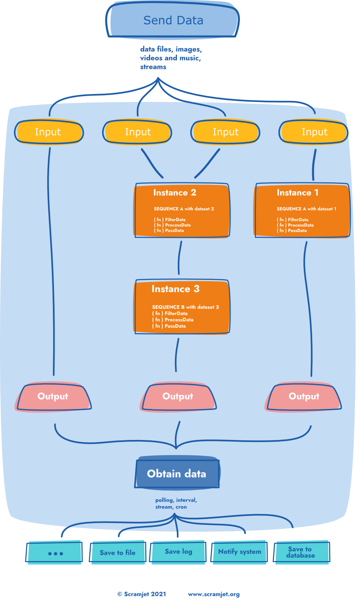
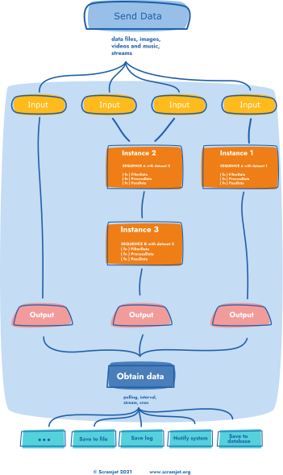

# Scramjet Cloud Platform Concept

Scramjet Cloud Platform is a distributed data processing platform that allows you to deploy, run and connect programs integrating data between separated environments just as if they were on a single machine. It allows users to run programs simultaneously in multiple languages, and interconnect multiple environments in virtual data spaces, where programs can share the data and expose it through a single, globally available API. With it you can easily process data while if flows between locations, networks, organizations or legal regimes.

We do not aim to be the Best Data Platform in every specific aspect, we just want to take the hassle of integrating data from multiple locations away from our users and let them focus on their core competence.

We want to help you get your job done.

Scramjet Cloud Platform's core Features:

* deploy and run simple long-running data processing programs called Sequences,
* use standards-based coding patterns without enforcing boilerplates or specific frameworks,
* use the platform console panel to interact with your Sequences,
* invoke Sequences programmatically via CLI or API or a set of client libraries,
* monitor and control running Sequences via one central, publicly available, secure API,
* send and receive data produces and required by running Sequences,
* share data between multiple Sequences by enclosing them in virtual Data Spaces,
* connect self-hosted servers to existing Data Spaces with minimum configuration,
* create execution environments at multiple cloud providers with a click of a button,
* low memory footprint allowing to run on machines with less than 256MB of RAM.

<!-- <BetaBanner /> -->

## Concept diagram

The diagram below shows the data flow using Scramjet Cloud Platform. Any type of data (file, image, stream, movie, etc.) can be used and passed into the input of an Instance. Please take a close look at the Instances in the diagram. They have been deployed using the same Sequence several times, which means that the same Sequence ("SEQUENCE A" in the diagram) has been started 3 times (2 times with the same dataset). The forth Instance was deployed using "SEQUENCE B", which in its transformation logic uses external API as a data input.

As a result, separate containers have been created for each Instance with a separated and safe environment. This is an effect of the scalability feature that STH has as one of its many functional features and strengths.

Transformed data can be obtained from the output and either saved on any database, file or can be passed forward to the other Instance for another transformation, or whatever else you would like to do with this data, it is up to you, the possibilities are limitless.

<!--
  ToDo: Use https://github.com/gatsbyjs/gatsby/tree/master/packages/gatsby-remark-copy-linked-files
 
-->

**Glossary:**

    <strong>Inputs</strong>

  <ol>
    <li> STH can handle any input that can be handled by Node.js application.</li>
    <li> You, as a developer, are free to process variety of inputs in your Sequence applications, such as: Text, JSON, XML, SOAP, Audio, Video and more.</li>
    <li> Inputs can be either:
      <ul>
        <li>Provided to STH via its REST API; or</li>
        <li>Consumed from various local or remote sources by the app; such as: Stream, STDIN, File, API, URL</li>
        <li>Generated by the app itself.</li>
      </ul>
    </li>
  </ol>

  

      <strong>Scramjet Cloud Platform</strong> - Sequence Flow
  

Scramjet Cloud Platform is responsible for maintaining and deploying Sequences, keeping them running and managing their lifecycle. This is a solution for the central processing and management unit with the following major components:

* **Sequence** - a user's program to be executed on the STH, that contains a developer's code that consists of one or more functions with a lightweight application business logic. It needs to be packed into a package together with its dependencies (compressed into `tar.gz` format) before sending it to STH
* **Instance** - once a Sequence is run, STH will create a separate runtime environment for it and will execute Sequence code inside this runtime entity. This is an Instance.
* **API & CLI** - our Application Programming Interface and Command Line Interface allow for:

  * Data operations - sending input data and receiving output data
  * Management operations - manage STH itself and its entities: Sequences or Instances

STH exposes also its own REST API to provide and receive data, manage Sequences, Instances and STH itself.

What we also do on the STH level is that we apply a set of algorithms to optimize and speed up data processing execution in Sequences. You can interact with STH using our dedicated [STH CLI](/platform/cli-reference), it will be quite helpful with deploying Sequences or interacting with running Instances.

STH is powered by [Scramjet Framework](https://www.npmjs.com/package/scramjet) - a fast, simple, functional reactive stream programming framework written on top of node.js object streams.

  

      <strong>Outputs</strong>
  

Our engine outputs can be managed in several ways:

* **File** - you can save your output to a local or a remote file
* **STDOUT** - output can be directed to system STDOUT (STDERR is supported as well)
* **API** - output can be consumed from our STH REST API
* **URL Request** - you can write your app in a way to request URL, webhook etc
* **Stream** - output can be streamed to a particular destination

You can mix multiple actions together: you can both send data to remote system/URL and save it locally.

## Program Lifecycle

Scramjet Cloud Platform can be treated both as data processing engine and execution platform for multiple Sequences running on the same platform and performing various data processing tasks.

SCP allows you to deploy and run multiple data processing apps called Sequences.

    <strong>Sequences</strong> are users programs/apps to be executed on the STH

We named our apps "Sequences", but they are not just any apps. They are specific apps that specialize in efficient data processing. "Sequence" term describes well its nature, as they process data through a sequence of chained functions. Therefore, usually our Sequences are concise, easy to write and powerful at the same time.

Every Sequence after being invoked becomes an Instance.

    <strong>Instance</strong> is a running Sequence

An Instance (computing instance) is a Sequence that has been run and is currently being executed on SCP, which creates a separate runtime environment and executes Sequence code inside this runtime entity. As Sequence can be started multiple times (e.g. with different parameters) it means that every Instance is literally an instance of a Sequence. Instance also can process an enormous amount of data on the fly without losing persistence.

Both Sequence and Instance have their own API, which you can explore in sections:

* [API Reference](../platform/api-reference/)
* [CLI Reference](../platform/cli-reference/)

    <strong>IFCA</strong> - Intelligent Function Composition Algorithms

Algorithms that use asynchronous functions under the hood and process streams of data in an efficient and optimized way.

The Transform Hub engine powering Scramjet Cloud Platform can run programs based on Node.js and Python and thus allows developers to benefit from rich ecosystem, numerous packages and solutions provided by this vibrant community.

## Handy links

*  [Repository with Quick Start and code samples](https://github.com/scramjetorg/scramjet-cloud-docs)
*  [STH solution open source repository](https://github.com/scramjetorg/transform-hub).
*  [STH NPM package](https://www.npmjs.com/package/@scramjet/sth)
*  [Scramjet CLI NPM package](https://www.npmjs.com/package/@scramjet/cli)
