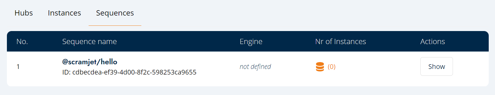

# Sequence Deployment



## Deploy one of the demo Transform Sequence programs

1. Download the repository

   ```bash
   git clone git@github.com:scramjetorg/scramjet-cloud-docs.git
   ```

1. Go to simple-counter-sample directory

   ```bash
   cd samples/simple-counter-js
   ```

1. Install dependencies and go back to the samples directory

   ```bash
   npm install && cd ../
   ```

1. Deploy the Transform Sequence program

   ```bash
   si seq deploy simple-counter-js
   ```

1. See the output form Sequence Instance process

   ```bash
   si inst stdout <sequence-id>
   ```

1. View the Instance List

## Write your own Transform Sequence from template

1. Download the repository

   ```bash
   git clone git@github.com:scramjetorg/scramjet-cloud-docs.git
   ```

1. Choose the template

   Templates allow you to apply predefined settings to start building your own applications.
   Depending on the needs please choose form:

   - JavaScript (Node.js)
   - TypeScript (ts-node)

     <br />

1. Make the template copy and write a Sequence

   ```bash
   cp -r templates/template-js/ samples/<sequence-name> && cd ../samples/<sequence-name>
   ```

   To write a Sequence please referee to the [App Reference](https://docs.scramjet.org/platform/app-reference)

1. Deploy the Sequence

   ```bash
   si seq deploy <sequence-name>
   ```

## Pack, Send, Run

Instead of deploying, you are allowed to run your Sequence step by step. Deploy can be devided to three separate steps: packing, sending and running.

1. Pack the Sequence

   Packaging the sequence is nothing else than packaging all the program files, including the dependencies and potentially also some binaries in a `tar.gz` file. While a simple `tar -czf package.tar.gz .` would work just as well, `si` provides a simple shorthand for this.

   ```bash
   si seq pack <sequence-name>
   ```

2. Send the Sequence

   Sending the sequence means that you upload the prepared `tar.gz` file to the platform. When you do so, the platform checks the contents of the file, identifies the runtime needed to run (ex. `py` programs are run with `python`), and prepare the hub for execution of said platform.

   ```bash
   si seq send <sequence-name>

   # alternatively - param will send the last packaged sequence
   si seq send -
   ```

3. Run the Sequence

   Running the Sequence is exactly the same as running a script on your own computer. The main function of your Sequence is called by a runner program in a container with the correct runtime identified in the previous step. Once the function is running you can manipulate it using `si` commands or the API.

   ```bash
   si seq run <sequence_id>

   # alternatively - param will run last sent Sequence
   si seq run -
   ```
