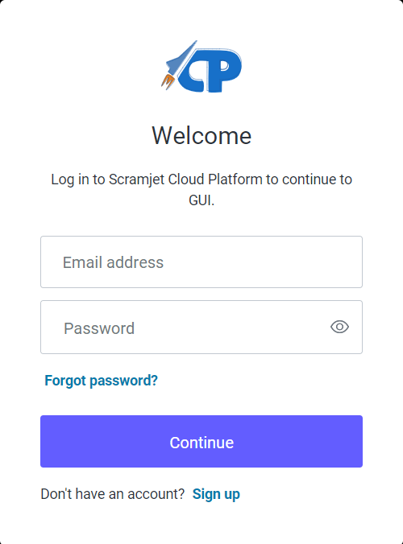
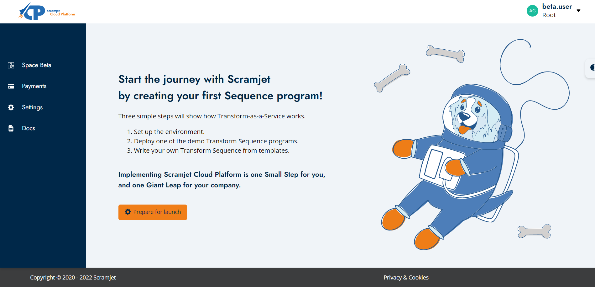
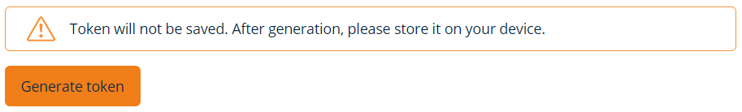

# Platform Quick Start

> **Deploy** and **execute** long running data **programs** that, **​transform** **in real-time** and transport **data** ​between multiple clouds and **on-premise** machines, just as **simply** as starting a program on a laptop, ​with no tedious configurations, VPNs or DevOps work.​

<!-- ## Joining the Beta Program to register

<BetaBanner /> -->

## Log in to Scramjet Cloud Platform Beta Panel

<div className="w-200"></div>

|  |  To use our platform **free of charge for a year**, please [sign up for the beta program](https://scr.je/join-beta-docs). <br/> If you are already our user, please log in to the [Scramjet Cloud Platform Beta Panel](https://console.beta.scramjet.cloud/) through your provided mail and set the new password by clicking `Forgot the password`. |
| ------------------------------------------------------- | ------------------------------------------------------------------------------------------------------------------------------------------------------------------------------ |

## Start the journey with Scramjet 🚀

There are only three simple steps!

- [Set up the environment](https://console.beta.scramjet.cloud/settings).
- [Deploy one of the demo Transform Sequence programs](https://docs.scramjet.org/platform/samples).
- Write your own Transform Sequence from [templates](https://docs.scramjet.org/platform/templates) in [JavaScript](https://docs.scramjet.org/platform/development-guide-js), [TypeScript](https://docs.scramjet.org/platform/development-guide-ts) or [Python](https://docs.scramjet.org/platform/development-guide-py)



## Step 1: Set up the environment

Dear user, in order to use our Beta Space, you need to have Linux based operating system installed eg. Ubuntu.
You will also need Node.js together with its package manager npm. Please refer to installation helper for node and npm in case of any problems. You must have Bash installed while using Windows.

Open the command prompt and follow the steps below to configure Scramjet Cloud Platform (SCP).

1. Check if the SCP Command Line Interface (SCP CLI) is installed by typing `si` into the terminal. If not, install SCP CLI by the command.

   ```bash
   npm i -g @scramjet/cli && si --help
   ```

2. Generate SCP CLI Token.

   [](https://console.beta.scramjet.cloud/settings)

   After token generation copy and paste the following CLI command for setting up config.

   ```bash
   si config set json '{"middlewareApiUrl": "https://api.beta.scramjet.cloud/api/v1", "env": "production", "token": "<GeneratedToken>"}'
   ```

3. Check if your setup is working properly by listing your programs (Sequences).

   ```bash
   si seq list
   ```

4. There should be sample program listed. Start it using the command:

   ```bash
   si seq start <sequence-id>
   ```

5. After the program starts the Instance id will be returned.

   Show output data form the running program (instance).

   ```bash
   si inst output <instance-id>
   ```

6. Open the new terminal and type the commend below and hit enter.

   ```bash
   si inst input <instance-id>
   ```

After the command execution, running Instance awaits for data to be passed as stdin. To do that please type into the command prompt, for example "John" and hit enter. In the terminal window where we read the Instance output the message: "Hello John" should appear.
