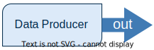
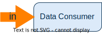
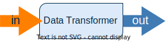
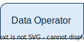

# Sequence

Transform as a Service Sequences are **small, data oriented, programs** that can be easily deployed and executed. In essence Sequences are the same as Lambda Functions, although in comparison to Function-as-a-Service Functions, TaaS Sequeces do not process every function each... {continue}

They are created based on our open-source Scramjet Framework. Thanks to that they are extremely fast in performing different operations on:

- [`➡ in`] incoming data,
- [`out ➡`] outgoing data.

Better yet a sequence is a long lived function that iterates on a stream of input data and returns a stream of output data. A sequence can contain a chained list of functions. It can take an input as an argument and return some output that can be passed to the next method.​

Because the sequences are long lived programs, you can run processing based on in-memory state using generators and asynchronous iteration.

When running a sequence you can pass additional arguments, these will be appended during the invocation of the first function.

Based on how they are written by the Developer, they can take the following roles:​

---

**`Data Producer​`** - obtains the data by its own means [`out ➡`] and performs 0 to any number of transforms on that data before returning it.

In order to return the data you can use one of the following:

- Return an Async Iterator
- Return a Generator
- Return a Stream

Sequences like these can be used to obtain data from an external source or for generating data programatically. Here's a couple of ideas:

- A Sequence querying a database with the SQL query as an additional argument
- A Sequence scraping a website repeatedly to check for new data
- A Sequence fetching a long CSV file and exposing data points one by one
- A Sequence generating random data for testing

The Data producer doesn't differ from other methods, it'll still get the input argument. It's just that you don't really use it in any way.

---

**`Data Consumer​`** - accepts the data from the platform [`➡ in`], performs any number of transforms and then saves it to the data destination by it's own means.

The input stream can be consumed as a stream or using async iteration protocols.

Consumer Sequences can be used to consume the data passed in topics, sent over the API or from other Sequences in the same Space. Here's a couple of potential use cases:

- Saving new data to a database, omitting known items
- Batching data from a stream
- Updating in-memory object for real-time API's
- Calling external API's when new data shows up
- Machine learning

The data consumer should read the input passed in the first argument and return a Future, or a Promise where applicable. When the Promise is resolved, the platform will assume that the sequence has completed and will attempt to stop and kill the program.

---

**`Data Transformer`​** - accepts data from the platform [`➡ in`], performs operations on the data [`out ➡`], and returns the data to the platforms for further use.

Transformers are essentially functions that read input and return an output. This can be used for:

- Wrangling data - changing from one format to one common with other sequences.
- Enrichment - fetching additional data from API's and databases for each item
- Data aggregation, moving window analysis
- Compression and encryption
- Data extraction (for instance: pictures from videos)
- Running AI inference on a ML Model

---

**`Data Operator​`** - doesn't accept data from the platform and doesn't output it.

A data opetator is just a function that runs operations without using input and output stream - it won't be removed until the returned promise is resolved.

Some use cases for operator Sequences:

- Running cron-like operations
- Simple processes that don't need data
- Just running a long running process that performs repeatable actions

---

\* Input, as well as output, is of **stream type**. However, it can transfer data and objects.

 

Scramjet Sequences **don’t require special knowledge** or domain-specific skills. Those are **simple programs** that even Junior Developers will understand easily.

> Simple code takes less writing. That means cost efficiency and a much faster time&nbsp;to&nbsp;market.
