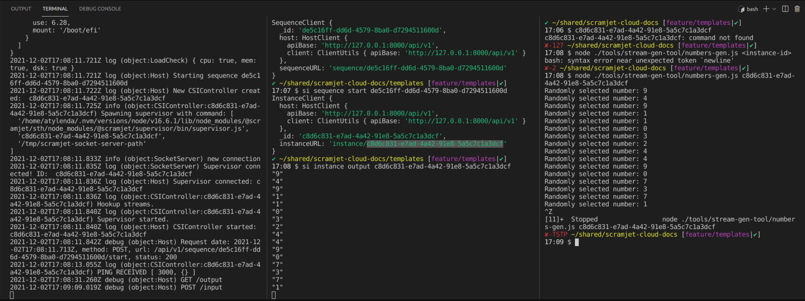
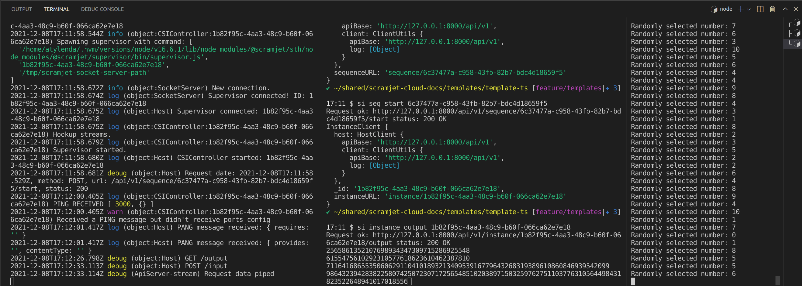

# Templates

We have prepared for you some ready to use templates. User templates allow you to apply predefined settings to start building your own applications. Using templates you can easily set up multiple applications with similar settings.

For this moment we support two variants of template in two programming languages:

- JavaScript (node) 👉 [go to GitHub](https://github.com/scramjetorg/scramjet-cloud-docs/tree/main/templates/template-js)
- TypeScript (ts-node) 👉 [go to GitHub](https://github.com/scramjetorg/scramjet-cloud-docs/tree/main/templates/template-ts)
- Python (ts-node) 👉 [go to GitHub](https://github.com/scramjetorg/scramjet-cloud-docs/tree/main/templates/template-py)

In the following sections we will describe both templates' contents and show you how they can be used in your own project.

> 💡 **Note!** Please refer to methods and definitions described in [App Reference](/platform/app-reference) when writing a Sequence code.

## Work with JavaScript (node)

This application template contains two files:

- **package.json** - this file holds all the important information about the project in plain JSON object format. It contains human-readable metadata about the project (like the project name and description) as well as functional metadata like the package version number or dependencies required by the application. This file is one of the basic requirement to have in the root of every project. This is the heart of any Node.js project, used by the application to find its dependencies to install, scripts to run, etc. If you would like to start your project from scratch, without using our js-template, you would need to create a directory and run `npm init` inside. This command would create a `package.json` file for you with all the obligatory properties, for example:

  ```json
  {
    "name": "sample-project", // the name of the project
    "version": "1.0.0", // the version of the project
    "description": "", // the short description of the project
    "main": "index.js", // the entry point/file of the project
    "scripts": {
      "test": "echo \"Error: no test specified\" && exit 1" // the script to run tests, you can add more scripts to this object
    },
    "author": "", // the author of the project
    "license": "ISC" // the license of the project
  }
  ```

  Of course more properties can be added to this object if you need them, such as `dependencies` and `devDependencies`. Dependencies are simply all the other modules that your project will use. In template's `package.json` file there is one more property `"repository"`, which shows the repository address, where the source code of the package is located.

  🤓 If you would like to learn more about the configuration in Node.js projects, please refer to the documentation on [Node.js official website](https://nodejs.dev/learn/introduction-to-nodejs).

- **index.js** - this is where you should put your code and all the logic of the application you create. It will be the entry point of your application. In our template we introduce you to a very straight forward application, which simply reads input stream and writes to the output stream.

  ```js
  const { PassThrough } = require("stream");

  module.exports = function (input) {
    /*
      THIS IS WHERE YOU SHOULD PUT YOUR CODE, AND ALL THE LOGIC OF YOUR APPLICATION
      We put some code below for demonstration, and also instructions to run this template with scramjet-transform-hub (STH).
    */

    // create a clean output stream
    const out = new PassThrough({ encoding: "utf-8" });

    input.on("data", data => {
      // write some data to the output stream
      out.write(data);
    });
    // return the output stream so it can be consumed (e.g. by CLI client)
    return out;
  };
  ```

This is what our template app does, it takes any input that will be sent or piped to it and simply writes it to the output stream. Of course you can add some logic to this function, but to keep the template simple we will just write the data to the output stream.

To see how this template works you can run it with a few simple commands written below:

> 💡 **Note!** To run this template you need to have those two packages installed: `npm install -g @scramjet/sth @scramjet/cli`

### **Open 3 terminals and run the following commands and let the magic begin** ✨

#### 1️⃣ terminal:

- run command `scramjet-transform-hub`

#### 2️⃣ terminal:

- `cd templates`
- `si pack template-js`
- `si seq send template-js.tar.gz`
- `si sequence start -`
- `si instance output -`

#### 3️⃣ terminal:

The command below will run the app in the background. The app generates random numbers from 1 to 10 and writes them to Instance's `/input` endpoint (to Instance which will be run on STH). In this way we are sending an input stream that will be consumed by our template app.

- `node ./tools/stream-gen-tool/numbers-gen.js <instance-id>`

### **Expected output:**



What you can see in the attached image is 3 terminals that illustrates the template's workflow:

- Terminal 1️⃣ shows the logs of running `scramjet-transform-hub` process.
- Terminal 2️⃣ shows the output of the program that we launched using STH CLI.
- Terminal 3️⃣ shows the output of the `node` command that runs the app which generates random numbers and sends them to the Instances's input.

## Work with TypeScript (ts-node)

TypeScript compiles to JavaScript. It is a superset of JavaScript, which means that you can use all the features of JavaScript plus some new features and advantages of TypeScript, then compile it and get regular JavaScript.

This application package template contains files:

- **package.json** - function of this file is similar to `package.json` file in [JavaScript template](<##Work-with-JavaScript-(node)>).

```json
{
  "name": "@template/template-ts",
  "private": true,
  "version": "1.0.0",
  "main": "index.js",
  "description": "This package is a User's template for ts-node projects",
  "author": "Scramjet <open-source@signicode.com>",
  "license": "GPL-3.0"
}
```

- **tsconfig.json** - it is a crucial file for managing your project, it creates itself after running `tsc --init` command, which initializes the TypeScript project. This file is where you can set the compiler options. Basically this is an indicator for TypeScript, which says that the project in which this file lies and all the other sub folders should be managed by TypeScript and it also tells Typescript how to compile all the `*.ts` files in the project.

```typescript
{
  "compilerOptions": {
    "outDir": "./dist",
    "esModuleInterop": true,
    "allowSyntheticDefaultImports": true
  },
  "include": [
    "./index.ts"
  ]
}
```

🤓 If you would like to learn more about the configuration in TypeScript projects, please refer to the documentation on [TypeScript official website](https://www.typescriptlang.org/docs/handbook/tsconfig-json.html) and [ts-node official website](https://typestrong.org/ts-node/).

- **dist** - this is a folder where the compiled JavaScript files will be stored. It will be created after running this script: `npm run build` together with compiled `index.js` file.

- **package-json.lock** - this is automatically generated file, which represent any operations where npm modifies either the `node_modules` tree, or `package.json`. It describes the exact tree that was generated, such subsequent installs are able to generate identical trees, regardless of intermediate dependency updates.

- **index.ts** - this is where you should put your code and all the logic of the application you create. It will be the entry point of your application.
  This file will be compiled into manila JavaScript `index.js` file and stored in the `dist` directory.

In our template we introduce you to a very straight forward application, which simply reads input stream and writes to the output stream.

> 📘 In the example below we use one of application type from [@scramjet/types](https://www.npmjs.com/package/@scramjet/types) module. Scramjet is a very nice and functional stream programming framework that you might find very useful while writing your app or dealing with streams in general. More read about Scramjet Framework and examples of usage you can find on [npm scramjet](https://www.npmjs.com/package/scramjet) or [GitHub](https://github.com/scramjetorg/scramjet).

```typescript
import { ReadableApp } from "@scramjet/types";
import { PassThrough } from "stream";

const app: ReadableApp<string> = async function (input) {
  /*
    THIS IS WHERE YOU SHOULD PUT YOUR CODE, AND ALL THE LOGIC OF YOUR APPLICATION
    We put some code below for demonstration, and also instructions how to run this template 
    with scramjet-transform-hub.
    */

  // create a clean output stream
  const outputStream = new PassThrough({ encoding: "utf-8" });

  input.on("data", data => {
    // write some data to the output stream
    outputStream.write(data);
  });
  // return output stream so it can be consumed (e.g. by CLI client)
  return outputStream;
};

export default app;
```

This is the minimal signature for a function that takes a stream and returns a stream.

```typescript
<T,U>(inp: ReadableStream<T>, ...args: any[]) => AnyReadable<U>
```

And this is what our template app does, it takes any input that will be sent or piped to it and simply writes it to the output stream. Of course you can add some logic to this function, but to keep the template simple we will just write the data to the output stream.

To see how this template works you can run it with a few simple commands written below:

> 💡 **Note!** To run this template you need to have those two packages installed: `npm install -g @scramjet/sth @scramjet/cli`

### **Open 3 terminals**, run the following commands and let the magic begin ✨

#### 1️⃣ terminal:

- run command `scramjet-transform-hub`

#### 2️⃣ terminal:

- `cd templates/template-ts`
- `npm install`
- `npm run build` - it runs build script in the template's package.json file, which compiles Typescript to JavaScript
- `cp -r node_modules/ package.json dist/` - it copies _node_modules_ and _package.json_ to the _dist_ folder
- `si pack dist` - it creates a _tar.gz_ archive of the _dist_ folder
- `si sequence send dist.tar.gz` - it sends the archive to STH
- `si sequence start - ` - it starts the Sequence (started Sequence turns into Instance)
- `si instance output - ` - it shows the Instance's output stream in the terminal

#### 3️⃣ terminal:

The command below will run the app in the background. The app generates random numbers from 1 to 10 and writes them to Instance's `/input` endpoint (to Instance which will be run on STH). In this way we are sending an input stream that will be consumed by our template app.

- `node ./tools/stream-gen-tool/numbers-gen.js <instance-id>`

### **Expected output:**



What you can see in the attached image is 3 terminals that illustrates the template's workflow:

- Terminal 1️⃣ shows the logs of running `scramjet-transform-hub` process.
- Terminal 2️⃣ shows the output of the program that we launched using STH CLI.
- Terminal 3️⃣ shows the output of the `node` command that runs the app which generates random numbers and sends them to the Instances's input.

## Additional package.json keywords

STH adds additional functionality to sequences and instances that can be manipulated via package.json keywords:

- **args** - optional array of arguments. On sequence start args are used as a default values passed down to your main Sequence method. (Read more about sequence arguments in [App Reference](/platform/app-reference#sequence-arguments-and-configuration))
